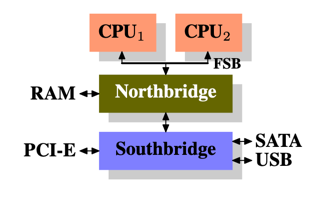
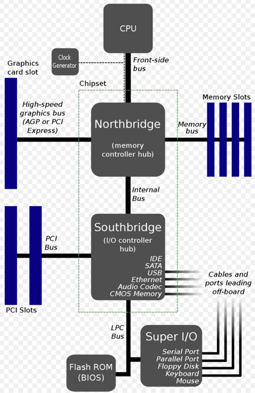
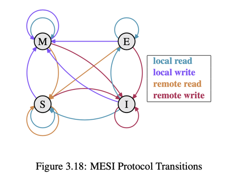
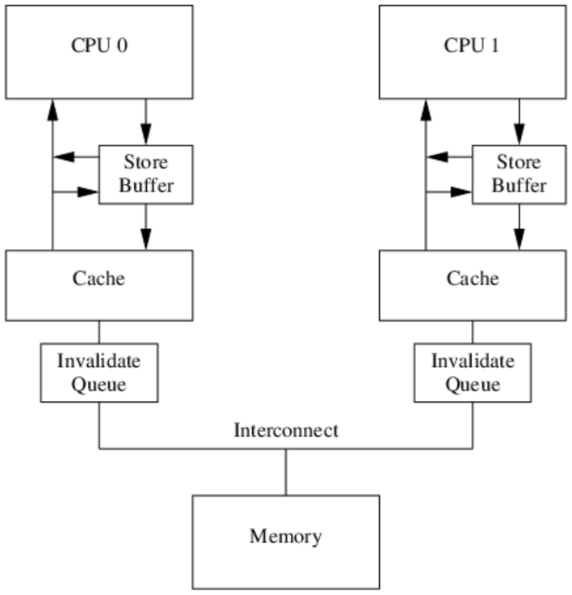

## 多核CPU性能优化及伴生问题的荆棘路
### 前言
#### 计算机中，CPU的运行速度与其它部件存在巨大差异，为了提高性能，在编译器、操作系统、CPU工作模式等体系结构上做了很大调整，但是，在解决了问题的同时，新增一个模块，势必带来一些其它的问题，例如，CPU加了缓存，提高了CPU执行效率的同时，缓存带来了一致性问题，而这也是本文讲述的重点之一。

### 关键字
<table>
    <th>名称</th>
    <th>所属模块</th>
    <th>解释</th>
    <tr>
        <td>FSB</td>
        <td>计算机通讯总线</td>
        <td>全称是font-side-bus，前端总线，负责CPU与北桥的交互</td>
    </tr>
    <tr>
        <td>Northbridge</td>
        <td>计算机芯片</td>
        <td>北桥，负责CPU与高速硬件（如内存）之间的数据交互</td>
    </tr>
    <tr>
        <td>Southbridge</td>
        <td>计算机芯片</td>
        <td>南侨，负责北桥与低速硬件（如硬盘）之间的数据交互</td>
    </tr>
    <tr>
        <td>缓存行</td>
        <td>缓存</td>
        <td>普遍指的是CPU核心内L1级缓存，分成若干缓存行</td>
    </tr>
    <tr>
        <td>Snoop协议</td>
        <td>CPU</td>
        <td>CPU通过监听内部前端总线上的地址总线读写事件，处理L1缓存的缓存行数据，包括但不限于变更缓存行状态、缓存行数据写回等操作。</td>
    </tr>
    <tr>
        <td>Store</td>
        <td>CPU</td>
        <td>CPU性能优化技术中，待应答的消息存入store buffer中，其它执行单元继续执行指令（带来指令存储的重排序，导致可见性问题）。</td>
    </tr>
    <tr>
        <td>Load</td>
        <td>CPU</td>
        <td>MESI协议执行时，为了避免发出Invalidate消息的CPU0出现阻塞，CPU1先回复Ack消息，然后把Invalidate消息存入Invalidate Queues中（但未来得及处理的情况下，CPU1读取该缓存行变量时，会存在数据不一致问题）。</td>
    </tr>
</table>

### CPU内部结构图

### MESI协议：
#### CPU各自对缓存行的操作，期间数据一致性由MESI协议维护，每个缓存行有四个状态，MESI由缓存行四个状态的首字母组成。
#### M：Modified，该缓存行在该核心内已被修改，数据已与内存不一致，且只有该核心的缓存行数据是有效的；
#### E：Exclusive，该缓存行被该核心独占，且没被修改，其它核心持有的都是无效的（Invalid）；
#### S：Shared，有多个核心持有该缓存行，且没有被修改；
#### I：Invalid，该核心内该缓存行已经为无效状态；

#### 其中，local可以理解为本核心发出的读写信号，remote可以理解为总线上发出的读写信号；

### Snoop协议：
#### MESI协议中，缓存行状态变更，通过CPU内Snoop协议实现，简单地说，所有核心，对数据对读写操作，都通过总线，广播给所有的CPU核心，然后各个核心去嗅探这些请求，再根据本地情况进行响应；
###### 缓存一致性的前提是，实现写传播和事务串行；
###### 写传播：在一个CPU核心里，缓存行数据更新，必须能够传播到其它核心的缓存行里；
###### 事务串行：在一个CPU核心里，读取和写入操作，在其它CPU核心节点看起来，顺序是一致的；

#### 上图中，纵轴代表CPU0核心某个缓存行的状态，横轴代表其它CPU核心，对应缓存行的状态；

### MESIF协议
#### 在上文中明显存在一个问题，MESI协议中，如果CPU0和CPU1，持有相同地址的cache line，且状态为Shared，而CPU2对该地址发出read请求时，由CPU0还是CPU1应答？
#### 貌似由谁应答都可以，但意味着通信开销增大；
#### MESIF协议是在MESI协议的基础上进行改良，增加了Forwarding，如果a在多个缓存行存在且状态为Shared，最后一个变为S状态的，会被选举为Forwarding状态，由该核心进行应答；

### CPU核心之间通信需要以下消息机制： 

<table>
    <th>消息名</th>
    <th>消息类型</th>
    <th>描述</th>
    <tr>
        <td>Read</td>
        <td>请求</td>
        <td>该消息包含cache line的地址，CPU核心通过总线发布对某个cache line内容的读取请求事件。</td>
    </tr>
    <tr>
        <td>Read Response</td>
        <td>响应</td>
        <td>该消息包含被请求数据的地址，这个消息可能是主内存返回的，也可能是其它CPU核心将缓存行提供的（同时需将数据刷回主存）。</td>
    </tr>
    <tr>
        <td>Invalidate</td>
        <td>请求</td>
        <td>该消息包含被请求缓存行的地址，通知其它CPU核心将自身高速缓存中该缓存行地址置位失效状态。</td>
    </tr>
    <tr>
        <td>Invalidate Acknowledge</td>
        <td>响应</td>
        <td>当CPU接收到Invalidate消息时，必须回复Invalidate Acknowledge，以表示删除了其高速缓存上的相应副本数据。</td>
    </tr>
    <tr>
        <td>Read Invalidate</td>
        <td>请求</td>
        <td>由Read消息和Invalidate消息组合而成的复合消息，作用是通知其它处理器，发送该消息的处理器准备更新一个数据，请求其它处理器删除高速缓存内该副本数据，接收该消息的处理器必须回复两个消息：Read Response 和 Invalidate Acknowledge。</td>
    </tr>
    <tr>
        <td>Write Back</td>
        <td>请求</td>
        <td>该消息包含需要写入低一级缓存的缓存行内容和地址，写回主内存会尽可能推迟，只有当替换算法要驱逐更新过的cache block时。</td>
    </tr>
</table>

### MESI协议带来的问题：
### 伪共享问题
#### 假设变量a，b在同一缓存行上，线程A只修改a变量，线程B只修改b变量，因此，当修改a时，线程B缓存行会被置为无效，但其实变量b并没有被修改，线程A同理，影响性能；
###### 解决方法：缓存行填充，空间换时间，让变量a，b不位于同一缓存行中。

### ABA问题
#### MESI协议无法保证并发场景下的RMW操作的安全性；
###### 解决方法：使用LOCK#前缀指令；

### 性能问题
#### CPU修改cache line变量时，需要通过总线发送Invalidate信息给远程CPU，等到远程CPU返回Ack后，才能继续进行修改，如果远程CPU处于繁忙状态，会带来更大的延迟；
###### 解决方法：引入Store Buffer（严格上来讲还配套store forwarding技术，即可以从store buffer中取结果进行计算，而不是从cache line中取）；

### 引入一个模块，就会带来一些问题
#### Store Buffer带来内存可见性问题

### 指令重排序：
<table>
    <th>排序</th>
    <th>所属模块</th>
    <th>作用</th>
    <th>具体例子</th>
    <tr>
        <td>编译器指令重排</td>
        <td>编译器</td>
        <td>减少CPU和内存的交互，尽可能保证CPU从寄存器或缓存行中读取数据</td>
        <td>JIT优化之——循环表达式外提</td>
    </tr>
    <tr>
        <td>处理器指令重排</td>
        <td>CPU</td>
        <td>提高CPU内部执行效率，在一个时钟周期内，充分利用内部多个执行单元</td>
        <td>并行指令集重排（提前执行其它可执行指令来填补CPU的时间空隙），内存系统重排（store-buffer)</td>
    </tr>
</table>

### CPU层面优化
<table>
    <th>方式</th>
    <th>背景</th>
    <th>原理</th>
    <th>潜在问题</th>
    <tr>
        <td>Store Buffer</td>
        <td>缓存一致性协议中，请求-应答机制使得CPU存在阻塞问题</td>
        <td>发出请求信息后，将指令存入store buffer中，继续往下执行</td>
        <td>对于CPU来说，变量同时存在于缓存行和Store Buffer中，存在一致性问题</td>
    </tr>
    <tr>
        <td>Store Forwarding</td>
        <td>引入了Store Buffer后，存在与缓存行数据不一致的情况</td>
        <td>CPU加载数据之前，会优先加载store buffer中的数据</td>
        <td>-</td>
    </tr>
    <tr>
        <td>Invalidate Queues</td>
        <td>Store Buffer本身容量有限，如果存在大量cache miss的情况，很容易被打满，而为了严格的缓存一致性，后续的指令，不管是否存在cache miss，都会因等待Invalidate Acknowledge消息而阻塞</td>
        <td>CPU在收到Invalidate消息后，将让该缓存行失效的消息存入Invalidate Queues，同步回复Acknowledge消息</td>
        <td>CPU内存系统Write操作的重排序问题，即CPU对于一个变量的读取，因先读取了缓存行，而没有先处理Invalidate Queues中的数据，存在读取到脏数据的问题</td>
    </tr>
</table>

### 通过内存屏障解决内存系统重排序问题
### 背景
#### CPU为了提高性能，使用了指令重排，进而在少数场景下导致了可见性问题，因此，让应用层的开发者，决定什么时候不产生内存重排序，便可以解决问题（牺牲了少部分）。
<table>
    <th></th>
</table>

### 总结
#### 在CPU的原子操作中，首先要保证原子操作的数据，在cache line上已对齐，跨缓存行会带来bus lock，CPU性能将直线下降，不管是CAS（MESIF协议实现缓存锁）还是内存屏障，最终都会转化为对cache line的操作，锁并没有消失，而是转嫁到ring bus的总线仲裁协议上去了，多核场景下，对同一地址的cache line进行CAS操作会引起反复的互相Invalidate，造成ping-pong效应，同样会降低性能，通常情况下，可以采用数据地址分离的模式，类似于thread-per-address。

### 参考资料
#### <a href="https://zh.wikipedia.org/zh-hans/%E5%8C%97%E6%A1%A5">维基百科-北桥</a>
#### <a href="https://research.cs.wisc.edu/multifacet/papers/micro06_ring.pdf">LLC-ring buffer design</a>
#### <a href="https://www.akkadia.org/drepper/cpumemory.pdf">Why Every Programer Should Know About Memory</a>
#### <a href="https://www.intel.cn/content/www/cn/zh/developer/articles/technical/intel-sdm.html">Intel开发人员手册-Vol 2A 3-614</a>
#### <a href="https://zhuanlan.zhihu.com/p/24146167">浅谈Lock与X86 Cache一致性</a>
#### <a href="https://www.cnblogs.com/gujiangtaoFuture/articles/14336014.html">缓存一致性与MESI协议Snoop操作</a>
#### <a href="https://juejin.cn/post/7031931006798004238">MESI 一致性协议引发的一些思考</a>
#### <a href="https://www.scss.tcd.ie/Jeremy.Jones/vivio/caches/MESI.htm">MESI协议趣味动画在线演示</a>
#### <a href="https://blog.chongsheng.art/post/golang/cpu-cache-memory-barrier/#false-sharing">博客文章-CPU缓存架构到内存屏障</a>
