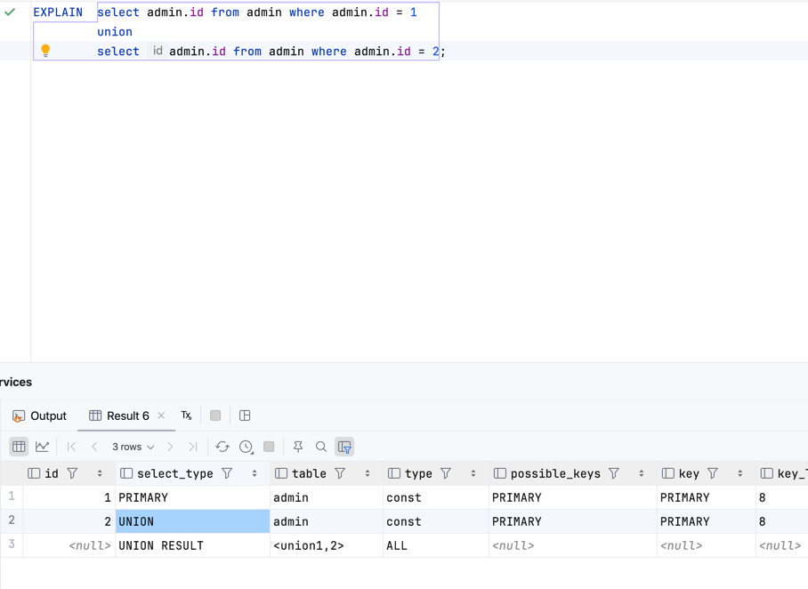
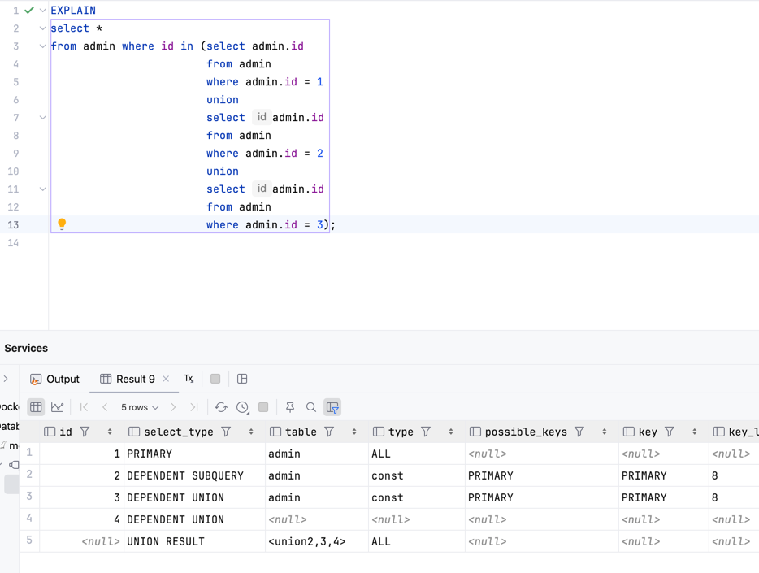

## MySQL执行计划详解

#### mysql执行计划有如下10列：

<table> 
    <th>id</th>
    <th>select_type</th>
    <th>table</th>
    <th>type</th>
    <th>possible_key</th>
    <th>key</th>
    <th>key_len</th>
    <th>ref</th>
    <th>rows</th>
    <th>Extra</th>
</table>

#### 其中最重要的列为：id、type、key、rows、Extra
### id：查询的序列号，表示操作表的顺序；
#### id相同：执行顺序由上到下；

#### id不同：如果是子查询，id的序号会递增，id值越大优先级越高，越先被执行；

#### id既有相同又有不同：常见于from后面带派生表，id值越大越先执行，相同的id，则从上到下执行；

### select_type：查询的类型，主要用于区分普通查询、联合查询、子查询等复杂的查询；
<table>
    <th>类型</th>
    <th>描述</th>
    <tr>
        <td>SIMPLE</td>
        <td>简单的select查询（查询中不使用子查询或者union）；</td>
    </tr>
    <tr>
        <td>PRIMARY</td>
        <td>查询中包含复杂的子查询，最外层查询被标记为PRIMARY；</td>
    </tr>
    <tr>
        <td>SUBQUERY</td>
        <td>在select或者where列表中包含了子查询；</td>
    </tr>
    <tr>
        <td>DERIVED</td>
        <td>派生表，子查询在from列表中；</td>
    </tr>
    <tr>
        <td>UNION</td>
        <td>若第二个select出现在UNION后，则标记为UNION；若UNION包含在from子句的子查询中，外层select将被标记为derived；</td>
    </tr>
    <tr>
        <td>UNION RESULT</td>
        <td>从union表中获取结果的select，即将每个union结果集合并到一起；</td>
    </tr>
    <tr>
        <td>DEPENDENT SUBQUERY</td>
        <td>子查询中，第一个select查询；</td>
    </tr>
    <tr>
        <td>DEPENDENT UNION</td>
        <td>子查询中的UNION操作中，从UNION第二个及之后的所有select语句，select type 都为 DEPENDENT UNION；</td>
    </tr>
</table>

### type：访问类型；
#### sql查询优化中一个很重要的指标，结果值从好到坏依次是：
#### system > const > eq_ref > ref > fulltext > ref_or_null > index_image > unique_subquery > index_subquery > range > index > ALL
#### 其中需要记住的是：system > const > eq_ref > ref > range > index > ALL
#### 一般来说，好的sql查询至少要达到range级别，最好能达到ref；

### possible_key：查询涉及到的字段上存在索引，则该索引将被取出，但不一定被查询实际使用；

### key：实际使用的索引，如果为NULL，则没有使用索引；
> 查询中如果使用了覆盖索引，则该索引仅仅出现在key列表中；
>

### key_len：表示索引使用的字节数；
#### 最大可能长度，并非实际长度（即该长度是通过表定义计算得到的，不是通过表内检索出的），在不损失精度的情况下，该值理论上越短越好；

### ref：显示索引的哪一列被用到了，如果可能，是一个常量const（即explain中，key列记录的索引中查找值所用的列或常量）；

### rows：sql查询所需读取的行数预估值（通过把所有的rows列值相乘，可粗略估算整个查询会检查的行数）；

### Extra：不适合在其它字段中显示，但十分重要的额外信息；
<table>
    <th>值</th>
    <th>描述</th>
    <tr>
        <td>Using filesort</td>
        <td>MySQL无法利用索引完成的排序操作称为‘文件排序’，说明MySQL会对数据使用一个外部的索引排序，而不是按照表内的索引顺序进行读取。</td>
    </tr>
    <tr>
        <td>Using Temporary</td>
        <td>使用了临时表保存中间结果，MySQL在对查询结果排序时使用临时表，常见于排序order by 和 分组查询group by。</td>
    </tr>
    <tr>
        <td>Using index</td>
        <td>使用了覆盖索引。</td>
    </tr>
    <tr>
        <td>Using index condition</td>
        <td>查询使用了覆盖索引，且索引为常量</td>
    </tr>
    <tr>
        <td>Using where</td>
        <td>使用了where过滤。</td>
    </tr>
    <tr>
        <td>Using join buffer</td>
        <td>使用了链接缓存。</td>
    </tr>
    <tr>
        <td>Impossible WHERE</td>
        <td>where子语句的返回值总是为false，不能用来获取任何元组。</td>
    </tr>
</table>

### 参考资料💾
#### <a href="https://blog.csdn.net/wuseyukui/article/details/71512793">MySQL高级 之 explain执行计划详解</a>
#### <a href="https://www.51cto.com/article/767432.html">MySQL执行计划Explain详解</a>
#### <a href="https://blog.csdn.net/Bronze5/article/details/113817719">MySQL执行计划之Using filesort</a>

