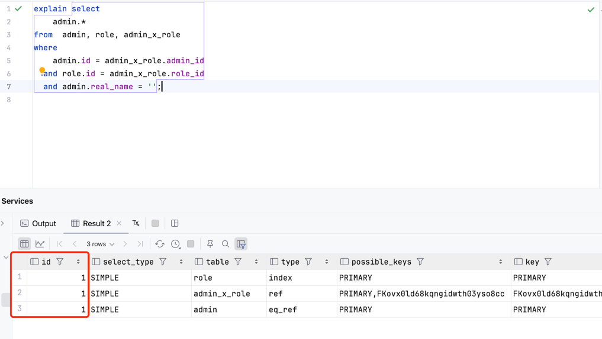
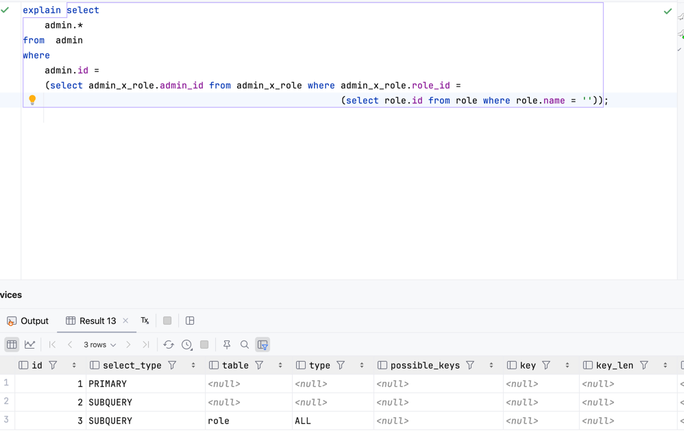
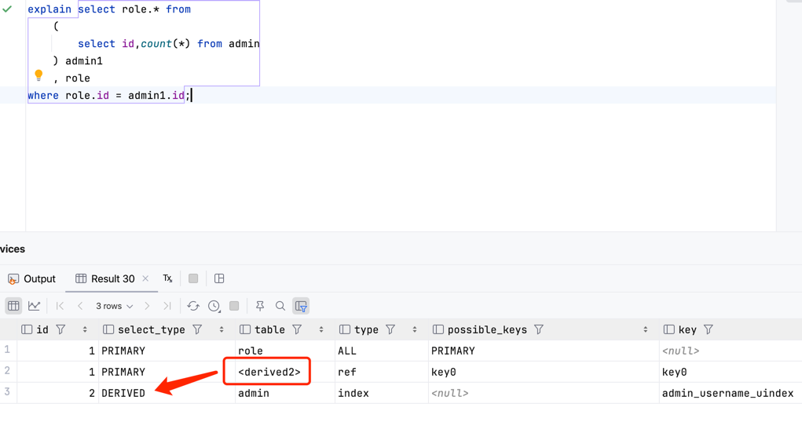

## MySQL执行计划详解

#### mysql执行计划有如下10列：

<table> 
    <th>id</th>
    <th>select_type</th>
    <th>table</th>
    <th>type</th>
    <th>possible_key</th>
    <th>key</th>
    <th>key_len</th>
    <th>ref</th>
    <th>rows</th>
    <th>Extra</th>
</table>

#### 其中最重要的列为：id、type、key、rows、Extra
### id：查询的序列号，表示操作表的顺序；
#### id相同：执行顺序由上到下；

#### id不同：如果是子查询，id的序号会递增，id值越大优先级越高，越先被执行；

#### id既有相同又有不同：常见于from后面带派生表，id值越大越先执行，相同的id，则从上到下执行；

### select_type：查询的类型，主要用于区分普通查询、联合查询、子查询等复杂的查询；
#### SIMPLE：简单的select查询，查询中不包含子查询或者union；
#### PRIMARY：查询中包含复杂的子查询部分，最外层查询被标记为PRIMARY；
#### SUBQUERY：在select或者where列表中包含了子查询；
#### DERIVED：在from列表中包含子查询被标记为derived（派生表）；
#### UNION：
#### UNION RESULT：

### 参考资料💾
#### <a href="https://blog.csdn.net/wuseyukui/article/details/71512793">MySQL高级 之 explain执行计划详解</a>
