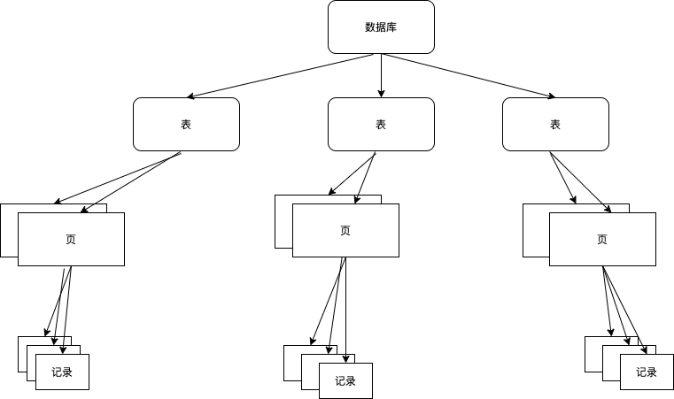
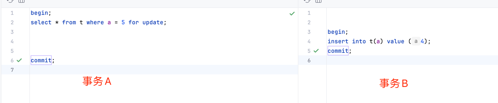
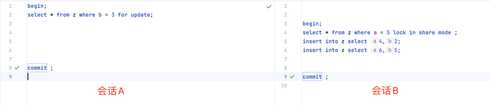

#  MySQL之锁
###  MySQL为什么要有锁？
#### mysql是一个面向多用户的数据库驱动应用，一方面要最大程度地承受并发访问，一方面要保证每个访问能以一致的方式读取和修改数据，因此有了锁的机制，用于管理对共享资源的并发访问。

### innodb中锁的类型有2种：共享锁 和 排他锁。
<table>
    <th>锁的形式</th>
    <th>锁的对象</th>
    <th>锁的目的</th>
    <tr>
        <td>共享锁 S Lock</td>
        <td>row 行记录</td>
        <td>允许事务读一行数据</td>
    </tr>
    <tr>
        <td>排他锁 X Lock</td>
        <td>row 行记录</td>
        <td>允许事务修改/删除一行数据</td>
    </tr>
</table>

> 排他锁和共享锁也可以加在表级别上，具体后面有sql介绍；

### 锁的兼容
#### 是否允许不同的事务，对同一行数据加锁，取决于锁的形式；
<table>
    <th></th>
    <th>X</th>
    <th>S</th>
    <tr>
        <td>X</td>
        <td>不兼容</td>
        <td>不兼容</td>
    </tr>
    <tr>
        <td>S</td>
        <td>不兼容</td>
        <td>兼容</td>
    </tr>
</table>

#### 兼容性只发生在不同的事务对同一行记录进行操作的情况中，由上表可知，当且仅当不同的事务对行记录的操作为共享锁时，锁才是兼容的，毕竟读操作不改变行记录，其余形式下，事务想加锁，需要依赖前一个事务释放了该行记录的锁。

#### 共享锁和排他锁不仅可以作用在行，也可以作用在表，sql如下：
```
    行级别：
    
    共享锁：select ... lock in share mode;
    排他锁：select ... for update;
```

```
    表级别：
    
    加共享锁：lock tables t_sku read;
    解共享锁：unlock table;
    
    加排他锁：lock tables t_sku write;
    解排他锁：unlock tables;
```
#### 小结：MySQL中，对行记录的操作，以事务的形式开启，以锁的形式保证数据操作的一致性；

### InnoDB多粒度锁
#### InnoDB存储引擎中，支持多粒度的锁定，允许事务在行级别的锁和表级别的锁同时存在；



### 意向锁
#### InnoDB增加了意向锁（Intention Lock），一种表级别的锁，不会与行级别的锁发生冲突，如果事务想对最细粒度的对象（记录）上锁，需先对粗粒度的对象上锁，期间若粗粒度的对象已被其它对象上锁，需先等待其它事务释放掉粗粒度的锁（表级锁不兼容的情况下）；
#### 意向共享锁（Intention S Lock）：事务想要获得一张表中某几行的共享锁（也就是说，一个数据行加共享锁之前，必须先取得该表的IS锁）；
>  -- 事务想要获取某些行的S锁，必须先获得行所在表的IS锁；
> 
>  select column from table ... lock in share mode;

#### 意向排他锁（Intention X Lock）：事务想要获得一张表中某几行的排他锁（事务在一个数据行加排他锁之前，必须先获得该表的IX锁）；
>  -- 事务想要获取某些行的X锁，必须先获得行所在表的IX锁；
> 
> select column from table ... for update;
>

### 为什么要有意向锁
#### 假设没有意向锁，以下事务操作流程:
#### 事务A获取了某一行的排他锁，但未提交：
```
    select * from user where id = 1 for update;
```
#### 事务B想要获取表锁
```
    lock tables user read;
```
#### 因为共享锁与排他锁互斥，所以事务B在视图对user表加共享锁时，需保证两个条件
> 1. 当前没有其它事务对user表持有排他锁；
> 2. 当前没有其它事务对user表中的任意一行数据持有排他锁；

#### 为了满足第二个条件，事务B必须在确保user表不存在任何排他锁的情况下，去检测user表对应的主键索引树的每一个节点id，是否存在排他锁，很明显效率很差；
#### 因此，有了意向锁，再根据意向锁与【表级别】的排他锁和共享锁的兼容性，便不用再去扫描整个主键索引树；

#### 表级意向锁和行级锁的兼容性如下：
<table>
    <th></th>
    <th>IS</th>
    <th>IX</th>
    <th>S（表级别）</th>
    <th>X（表级别）</th>
    <tr>
        <td>IS</td>
        <td>兼容</td>
        <td>兼容</td>
        <td>兼容</td>
        <td>不兼容</td>
    </tr>
    <tr>
        <td>IX</td>
        <td>兼容</td>
        <td>兼容</td>
        <td>不兼容</td>
        <td>不兼容</td>
    </tr>
    <tr>
        <td>S（表级别）</td>
        <td>兼容</td>
        <td>不兼容</td>
        <td>兼容</td>
        <td>不兼容</td>
    </tr>
    <tr>
        <td>X（表级别）</td>
        <td>不兼容</td>
        <td>不兼容</td>
        <td>不兼容</td>
        <td>不兼容</td>
    </tr>
</table>

> IS与IX是完全兼容的；
> 
> IS与IX只会跟【表级别】的S X存在兼容性问题；
> 
> IS与IX【不会】跟【行级别】的S X 存在兼容问题！！！（非常重要，强调三遍！！！）
> 
> IS与IX【不会】跟【行级别】的S X 存在兼容问题！！！（非常重要，强调三遍！！！）
> 
> IS与IX【不会】跟【行级别】的S X 存在兼容问题！！！（非常重要，强调三遍！！！）

#### 沿用上述事务A和事务B的例子🌰，有了意向锁之后，此时事务B在获得user表的共享锁之前，检测到事务A持有user表的意向排他锁，就可以得知事务A必然持有该表中某些数据行的排他锁，那么事务B对user表对加锁请求将阻塞，而无需再去检查表中的每一行数据是否存在排他锁；

> tips：意向锁有自己的数据引擎维护，用户无需手动操作意向锁，在为行数据加共享/排他锁之前，InnoDB会先获取行所在表的对应意向锁；

> 总结：
> 1. InnoDB行级锁是通过在索引上的项去实现的，因此，只有通过索引条件进行数据检索，才会加行级锁（这里与Oracle有区别，Oracle的行级锁，是通过在数据行上加锁实现的）；
> 2. 没有通过索引项检索数据，InnoDB将使用表锁；
> 3. InnoDB中的排他锁和共享锁，都是表锁；
> 4. 意向锁是有自己的数据引擎维护的，用户无需手动设置意向锁，在为行数据加共享锁或者排他锁之前，InnoDB会先获取该数据行所在的表的对应意向锁；
> 
### 通过锁，可以实现事务隔离性的要求，由此衍生的锁的算法有3种：
> 1. record lock单个行记录上的锁。
> 2. gap lock:范围锁，锁定一个范围但不包含记录本身。
> 3. next-key lock: record lock + gap lock，不仅锁住一个范围，也包含范围的记录本身。

#### 当查询的索引含有唯一属性时，InnoDB存储引擎会对next-key lock算法进行优化，将其降级为record lock，即仅仅锁住索引本身，而不是范围：
```
    drop table if exists t;
    create table t (a int primary key);
    insert into t select 1;
    insert into t select 2;
    insert into t select 5;
```

#### 事务A中，先对记录5加上X锁，由于a是主键且唯一，算法锁住的是[5],而不是（2,5），因而事务B中插入记录4，不会被阻塞。即算法由next-key lock 降级为 record lock，从而提高了应用的并发性；

#### 当查询的索引是辅助索引时
```
    drop table if exists z;
    create table z (a int, b int, primary key(a), key(b));
    insert into z select 1, 1;
    insert into z select 3, 1;
    insert into z select 5, 3;
    insert into z select 7, 6;
    insert into z select 10, 8; 
```



#### 如上图，当会话A中，锁住的该行记录中，对应的主键索引是a = 5，辅助索引是b = 3，因此也用record-lock先将主键a=5锁住，其次，针对辅助索引，使用gap-lock算法，不仅锁住(1,3) 还锁住(3,6)；
#### 因此会话B中的所有SQL操作将被阻塞，直至会话A提交；
#### 总之，gap-lock算法，目的是阻止多个事务将记录插入到同一个范围内，避免了幻读产生；
#### 如果不想使用gap-lock，可将数据库的事务隔离级别设置为RC，仅在外键约束和唯一性约束需要使用gap-lock，优点是提高了并发能力；
#### 缺点是：破坏了事务的隔离性。

#### innodb中事务隔离性中的repeatable read 便是由next-key lock 算法实现，从而避免幻读造成的行数前后不一致问题 和 不可重复读中的行内容前后不一致问题。
#### innodb存储引擎下的事务遵循acid规范，其中的isolation 隔离性，具备4种级别：read-uncommitted(读未提交) read-committed(读已提交）repeatable read（可重复读）serializable（序列化）,资源耗费从左到右依次增加；
### |---隔离级别-----------------|--脏读--|--不可重复读--|--幻读--|--加锁读
### |---read-uncommitted---|-yes----|-yes-------------|--yes--|--no---
### |---read-committed-------|-no-----|-yes-------------|--yes--|--no--
### |---repeatable-read-------|-no-----|-no---------------|--yes--|--no
### |---serializable-------------|-no-----|-no---------------|--no---|-- yes
### 开2个会话，打开2个事务，模拟并发情况下
### 脏读：在事务b中插入一行数据但未提交，在事务a中能读取到改行数据。
### 不可重复读：在事务b中修改一行数据并提交，在事务a中能读取到修改后的行数据，重点在于修改。某种程度上来说，这是被允许的。（在innodb中，通过使用Next-Key Lock 算法来避免不可重复读读问题。比如对于select * from t where a <= 5, 在隔离级别为repeatable-read 下，不仅锁住了扫描到的索引，还锁住了这些索引覆盖的范围。）
### 幻读：在事务b中在事务b中插入or删除一行数据并提交，在事务a中前后读取的行数据量不同，重点在于 插入 or 修改。某种程度上来说，这是被允许的。
### 加锁读：通过加锁读方式强制事务串行化之行。
##  事务操作数据的过程中，为了保证数据安全，会用锁来锁住数据，事务在执行过程中，因争夺锁资源而造成互相等待的现象，称之为死锁。
### innodb中，解决死锁的方式有2种：
### 一种是超时回滚，即2个事务相互等待时，当一个的等待时间超过阈值，将其回滚，另一个继续进行，通过innodb_lock_wait_timeout参数来设置等待阈值。这个方法的弊端在于，如果回滚的事务所占执行权重比较大，例如事务操作更新了很多行，占用了较多的undo log，回滚这个事务的时间相对另一个事务所占用的时间可能会很多。
### 另一种是普遍采用的wait-for graph方式来进行死锁检测，事务执行时，innodb保存锁的信息链表 和 事务等待链表 两种信息，通过信息构成一张等待图，每一个事务请求锁并发生等待时都会判断是否存在回路，当出现回路的情况下，即为死锁，Innodb选择回滚undo量最小的事务。
##  死锁的预防
### 这里说结论，系统中事务数量多是没办法的事情，但应用程序中，应控制每一个事务中，尽可能少地操作数据库表中的数据，简单地说，使得数据库中锁占用的时间少，数量少，锁住的范围小。

## mysql的锁也会带来三个问题
### 脏读：读到其他事务未提交的数据，这种情况通常发生在隔离级别为read-uncomitted

### 可重复读：读到其他事务提交的数据，这种情况通常发生在隔离级别为read-committed中，但这种情况是能接受的，如果使用了next-key lock，还是能保证不让某些范围内的数据出现重复读的情况

### 丢失更新： 指的是，一个事务中的更新，被另一个事务中的更新所覆盖，举个例子，开启两个客户端，对账号为1w元的账户进行转账，a转账9000，b转账1元，原本账户应该剩下999元，但由于b中的事务覆盖了a中的事务更新，最终账户有9999元，钱变多而账不平。。这种情况下只能将事务变成串行，在a中转账更新前，先通过select * from account where num = 'xxx' for update，挂上一个排它锁，此时b客户端的转账1元操作将被阻塞，a客户端通过select发现余额足够，进行update操作，然后释放锁，b客户端执行同样流程

### 参考资料💾
<a href = "https://juejin.cn/post/6844903666332368909">详解 MySql InnoDB 中意向锁的作用</a>
