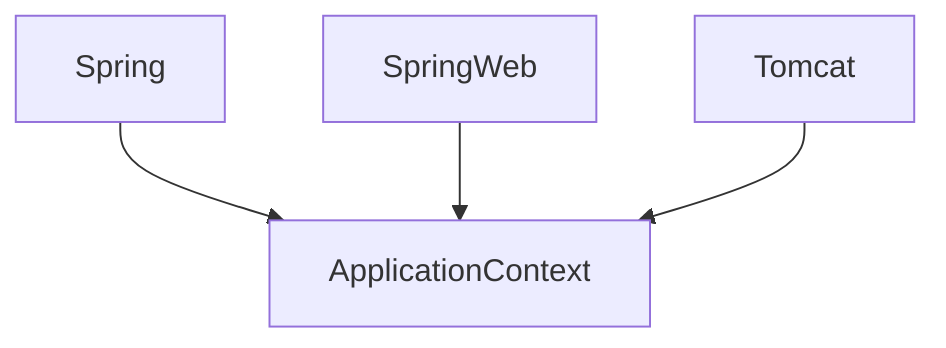

# Spring-Boot 5大特性
#### SpringBoot背靠Spring Framework这座大山，在高度抽象和简化能力上，实现了一些特性；
### Spring Application
### 自动装配
### 外部化配置
### Spring boot Actuator
### 嵌入式web容器

## 注解
#### @SpringBootApplicaton = @EnableAutoConfiguration + @Configuration + @ComponentScan

## 调用
#### 对于SpringBoot来说，应用满足开箱即用，自动装配的特性


#### @ConditionalOnBean 存在某个bean作为注入参数时，主要的bean才会被实例化；
```
    @Component
    @ConditionalOnBean(name = "redisTemplate")
    public class RedisOperationBean {
        private final RedisTemplate redisTemplate;
        
        public RedisOperationBean(RedisTemplate redisTemplate) {
            this.redisTemplate = redisTemplate;
        }
        ...
    }
    
```

> 假设RedisOperationBean是一个第三方包，被模块A间接引用了，但是A本身并不需要操作redis，因此也不会因为创建RedisOperationBean而跑异常；


## spring.factories
#### 由于@ComponentScan只能扫描spring-boot项目包内的bean并注册到容器中，因此需要@EnableAutoConfiguration注解来注册项目包外的bean，而spring.factories文件则是用来记录项目包外需要注册的类名；