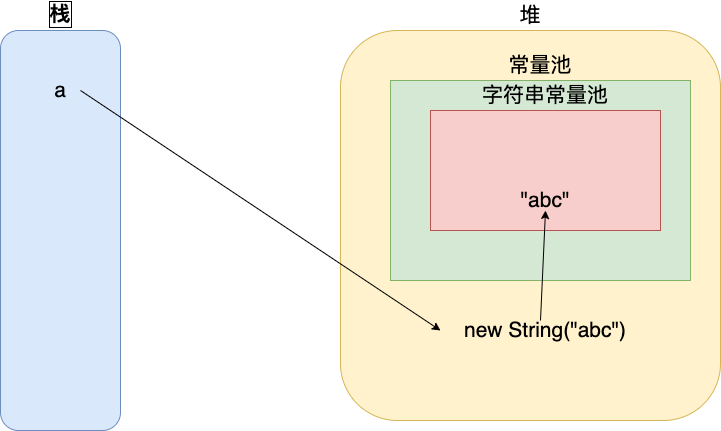

### String类解析
#### 先来一道题
```
    String a = new String("abc");
    上述代码生成了多少个对象？
```

#### 答案是，1个或者2个；
#### 先看一张JMM结构图：


#### 在JDK8发布后，字符串常量池被挪到了Heap中；
#### new String("abc"); 首先在字符串常量池中检查是否存在 abc，若有，则返回对应的引用实例，若无则创建对应的实例，随后在Heap中new一个String类型的"abc"对象，最后将对象地址赋值给栈上的a变量，并创建一个引用；



### Q&A
#### String a = "ab" + "cd"; 创建了多少个对象？
> 分析：若该字符串常量池该字符串对象
> 1. 字符串常量池: "abcd" 1个对象；
> 2. 堆：0个对象；
> 3. 栈：a 1个引用；
> 4. 总共：1个对象，1个引用；
> 5. JVM优化之后，变成：String a = "abcd";

#### String a = new String("abc"); 创建了多少个对象？
> 分析：若该字符串常量池该字符串对象
> 1. 字符串常量池: "abc" 1个对象；
> 2. 堆：new String("abc") 1个对象；
> 3. 栈：a 1个引用；
> 4. 总共：2个对象，1个引用；

#### String a = new String("a" + "b"); 创建了多少个对象？
> 分析：若该字符串常量池该字符串对象
> 1. 字符串常量池: "ab" 1个对象；
> 2. 堆：new String("ab") 1个对象；
> 3. 栈：a 1个引用；
> 4. 总共：1个对象，1个引用；
> 5. JVM优化之后，变成：String a = new String("ab")

#### String a = new String("ab") + "ab"; 创建了多少个对象？
> 分析：若该字符串常量池该字符串对象
> 1. 字符串常量池: "ab" 1个对象；
> 2. 堆：new String("ab") 1个对象；
> 3. 栈：a 1个引用
> 4. 总共：2个对象，1个引用；

#### String a = new String("ab") + new String("ab"); 创建了多少个对象？
> 分析：若该字符串常量池该字符串对象
> 1. 字符串常量池: "ab" 1个对象；
> 2. 堆：new String("ab), new String("ab") 2个对象；
> 3. 栈：a 1个引用；
> 4. 总共：3个对象，1个引用；

#### String a = new String("ab") + new String("cd"); 创建了多少个对象？
> 分析：若该字符串常量池该字符串对象
> 1. 字符串常量池: "ab"、"cd" 2个对象;
> 2. 堆：new String("ab") new String("cd") 2个对象 ;
> 3. 栈：a 1个引用
> 4. 总共：4个对象，1个引用

#### String a = "ab";
#### String b = "cd";
#### String c = a + b; 创建了多少个对象？
> 分析：若该字符串常量池该字符串对象
> 1. 字符串常量池: "ab"、"cd"、"abcd" 3个对象
>    2. 堆：无·
> 3. 栈：a、b、c 3个引用
> 4. 总共：3个对象，3个引用

#### 通过intern()方法，指向字符串常量池中特定对象：
code:
```
    String a = "abc";
    String b = new String("abc");
    String c = b;
    
    System.out.println("a == b：" + (a == b));
    System.out.println("a == c：" + (a == c));
    
    String d = b.intern();
    System.out.println("a == d：" + (a == d));
```

result:
```
    a == b: false
    a == c: false
    a == d: true
```

### 参考资料
<a href="https://www.cnblogs.com/Andya/p/14067618.html">JVM-字符串常量池详解</a>