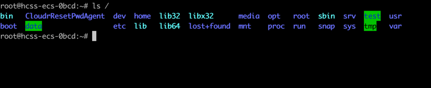
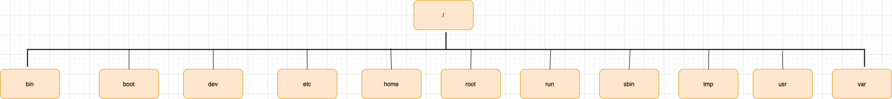

# Linux 文件目录及其解释

#### Linux文件目录图

> ls : list directory contents

#### Linux文件目录示意图

<table>
    <th>文件名</th>
    <th>全称</th>
    <th>解释</th>
    <tr>
        <td>/bin</td>
        <td>binary</td>
        <td>存放二进制文件，经常使用的命令</td>
    </tr>
    <tr>
        <td>/boot</td>
        <td>-</td>
        <td>启动Linux时的一些核心文件，包括一些核心文件以及镜像文件</td>
    </tr>
    <tr>
        <td>/dev</td>
        <td>device</td>
        <td>Linux的外部设备</td>
    </tr>
    <tr>
        <td>/etc</td>
        <td>等等</td>
        <td>存放系统管理所需要的配置文件和子目录</td>
    </tr>
    <tr>
        <td>/home</td>
        <td>用户的主目录</td>
        <td>Linux系统中，每个用户都会有一个自己的目录</td>
    </tr>
    <tr>
        <td>/lib</td>
        <td>Library</td>
        <td>存放着系统最基本的动态连接共享库，几乎所有的应用程序都需要用到这些共享库</td>
    </tr>
    <tr>
        <td>/lost+found</td>
        <td>-</td>
        <td>平时是空的，当系统发生意外后，丢失的文件可在这里找回，只有root用户才能打开</td>
    </tr>
    <tr>
        <td>/media</td>
        <td>媒体</td>
        <td>系统会自动识别一些设备，例如U盘、光驱等等，当识别后，Linux会把识别的设备挂载到这个目录下</td>
    </tr>
    <tr>
        <td>/mnt</td>
        <td>挂载</td>
        <td>方便用户临时挂载别的文件系统，可以将光驱挂载在该目录上</td>
    </tr>
    <tr>
        <td>/opt</td>
        <td>optional</td>
        <td>主机额外安装的软件，可以放在该目录下，默认是空的</td>
    </tr>
    <tr>
        <td>/proc</td>
        <td>Processes</td>
        <td>虚拟文件系统，存储的当前内核运行状态的一系列特殊文件，系统内存的映射，可以直接访问这个目录进而获取系统信息</td>
    </tr>
    <tr>
        <td>/root</td>
        <td>系统管理员目录</td>
        <td>超级权限者的用户主目录</td>
    </tr>
    <tr>
        <td>/sbin</td>
        <td>super user binaries</td>
        <td>存放的是系统管理员使用的系统管理程序</td>
    </tr>
    <tr>
        <td>/tmp</td>
        <td>temp</td>
        <td>存放一些临时文件</td>
    </tr>
    <tr>
        <td>/var</td>
        <td>variable</td>
        <td>这个目录中存放着不断扩充的东西，例如日志文件</td>
    </tr>
    <tr>
        <td>/run</td>
        <td>-</td>
        <td>临时文件系统，存储系统启动以来的信息，当系统重启时，这个目录下的文件应该被删除</td>
    </tr>
    <tr>
        <td>/usr</td>
        <td>unix shared resources</td>
        <td>用户的很多应用程序和文件都放在这个目录下，类似于Windows系统的Program Files目录</td>
    </tr>
    <tr>
        <td>/usr/bin</td>
        <td>unix shared resources binaries</td>
        <td>系统用户使用的应用程序</td>
    </tr>
    <tr>
        <td>/usr/sbin</td>
        <td>unix shared resources super user binaries</td>
        <td>超级用户使用的比较高级的管理程序和系统守护程序</td>
    </tr>
    <tr>
        <td>/usr/src</td>
        <td>-</td>
        <td>内核源码存放的地方</td>
    </tr>
</table>