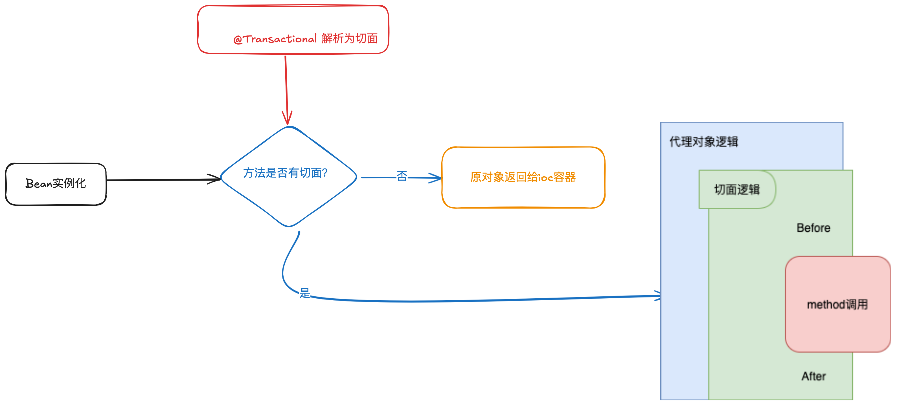

# Spring事务失效场景
#### 事务的原理是封装了JDBC的事务API，基于AOP实现(默认JDK动态代理)，流程如下：


#### 8大失效场景
#### 1. 代码抛出IOException
```
    @Trancational
    public void trancationalTest throw IOException {
        User user = new User();
        userService.save(user);
        throw new IOException();
    }
    
    /**
     * 事务默认处理RuntimeException 跟 Error
    **/
    public boolean rollbackFor(Throwable ex) {
        return (ex instanceOf RuntimeException || ex instanceOf Error);
    }
```
#### 解决方式：指定异常回滚
```
    @Trancational(rollbackFor = Exception.class)
    public void trancationalTest throw IOException {
        User user = new User();
        userService.save(user);
        throw new IOException();
    }
```

#### 2. 业务本身捕获了异常
```
    @Trancational(rollbackFor = Exception.class)
    public void trancationalTest throw IOException {
        try {
            User user = new User();
            userService.save(user);
            int i = 1 / 0;
        } catch (Exception ex) {
            e.printStaceTrace();
        }
    }
```

#### 3. 同一类中的方法调用
```
    @Service
    public class TransactionalExam implement Service {
        @Resource
        private UserService userService;
        
        public void saveUser() {
            doInsert();
        }
        
        @Transactional(rollbackFor = Exception.class)
        public void doInsert() throws IOException {
            User user = new User();
            userService.save(user);
            throw new IOException();    
        }
    }
```
#### 出错原因：Spring的事务管理是通过代理去实现的，调用saveUser()方法，doInsert()是通过真实对象调用的，因而doInsert()的事务会失效；
#### 解决问题的方式：
```
    @Service
    public class TransactionalExam implement Service {
        @Resource
        private UserService userService;
        
        // 方式一：给saveUser()方法加上事务(这里解决的不是doInsert()方法的事务失效问题，而是让saveUser() 方法受事务管理)。
        @Transactional(rollbackFor = Exception.class)
        public void saveUser() {
            // 方式二：通过AopContext容器，获取当前方法的代理类，通过代理类去调用doInsert()方法。
            TransactionalExam aopProxy = (TransactionalExam) AopContext.currentProxy();
            aopProxy.doInsert();
        }
        
        @Transactional(rollbackFor = Exception.class)
        public void doInsert() throws IOException {
            User user = new User();
            userService.save(user);
            throw new IOException();    
        }
        
        // 方式三：@EnableAspectJAutoProxy(exposeProxy = true)在启动类中添加，会由Cglib代理实现。
    }
```

#### 4. 方法使用了final 或 static 关键字
#### 被上述关键字修饰的方法，无法被继承，
#### Spring如果使用Cglib动态代理，需要实现该类，并重写所有方法，进而生成代理对象；
#### Spring如果使用JDK动态代理，需要实现该类的借口，重写所有方法，进而生成代理对象；
#### 综上，不管是用哪种代理方式，如果类的方法无法被重写，自然没有代理方法，事务也无法实现；
#### 解决方式：去掉final或static关键字。

#### 5. 方法不是public
#### Spring事务实现，如果非public方法，无法使用事务管理，源码地址：org.springframework.transaction.interceptor.AbstractFallbackTransactionAttributeSource#computeTransactionAttribute
```
    protected TransactionAttribute computeTransactionAttribute(Method method, @Nullable Class<?> targetClass) {
        // Don't allow no-public methods as required.
        if (allowPublicMethodsOnly() && !Modifier.isPublic(method.getModifiers())) {
            return null;
        }
        ...
	}
```
#### 解决方式：将方法访问级别改为public

#### 6. 错误使用传播机制
```
    @Service
    public class TransactionalExam {
        @Resource
        private UserService userService;
        
        @Resource
        private AddressService addressService;
        
        @Transactional(propagation = REQUIRE.NEW, rollbackFor = Exception.class)
        public void doInsert(User user, Address address) throws Exception {
            userService.save(user);
        }
        
        @Transactional(propagation = REQUIRE.NEW)
        public void saveAddress(Address address) {
            addressService.save(address);
        }
    }
```
#### REQUIRE：默认事务传播属性，如果当前上下文存在事务，则加入事务，不存在则创建一个事务；
#### REQUIRE.NEW：如果当前上下文不存在事务，则创建一个事务，如果存在，则将事务挂起，再新建一个子事务并执行，子事务完成后，才会提交父事务，父事务抛异常，不影响子事务的提交；
#### 上述场景中，即使doInsert()方法抛异常，saveAddress()方法也会照常执行；
#### 解决方式：将REQUIRE.NEW改为默认的REQUIRE；

#### 7. 没有被Spring容器管理
```
    // @Service
    public class TransactionalExam {
        @Resource
        private UserService userService;
        
        @Transactional(rollbackFor = Exception.class)
        public void doInsert(User user, Address address) throws Exception {
            userService.save(user);
        }
    }
```
#### 解决方法：需要保证每一个Bean都被Spring容器管理；

#### 8. 多线程
```
    @Service
    public class TransactionalExam {
        @Resource
        private UserService userService;
        
        @Resource
        private AddressService addressService;
        
        @Transactional
        public void add(User user) throws Exception {
            userService.save(user);
            new Thread(() -> {
                try {
                    test();
                } catch (Exception e) {
                    addressService.doSomething();
                }
            }).start();
        }
    }
    
    @Service
    public class AddressService {
        @Transactional
        public void doSomething() {
            try {
                int i = 1 / 0;
                sout("save address message");
            } catch (Exceptin e) {
                throw new RuntimeException();
            }
        }
    }
```
#### 用了多线程，add(User user)方法跟doSomething()方法获取的数据库连接不是同一个，因而是不同的事务，只有拥有同一个数据库连接，才能同时提交和回滚；
#### 解决方法：尽量保持在同一个事务中。 

### 参考资料
<a href="https://juejin.cn/post/7179080622504149029">8个Spring事务失效的场景，你碰到过几种？
</a>
