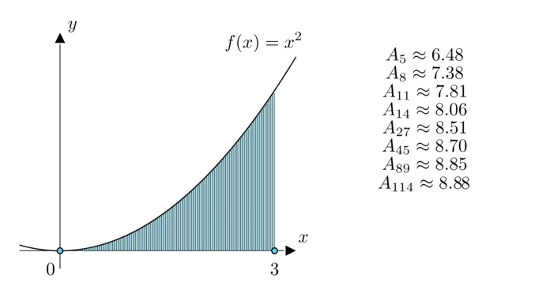

### 数列的定义
#### 以正整数为定义域Z+，值域是某种数系的函数；
#### 对于每一个n ∈ Z+，对应着一个实数an，按照下标n从小到大排列得到的一个序列，就叫做数列，也可以简记为{an}；
#### {an} = {a1,a2,a3,...,an};
#### 其中每一个项叫做数列的项，第n项an叫做数列的通项；

### 从古典微积分到柯西的数列极限
#### 求曲边梯形的面积
    

#### 古典微积分

#### 所以，四个矩形面积和A4为：
#### A4 = 3/4 * 0^2 + 3/4 * (1 * 3/4)^2 + 3/4 * (2 * 3/4)^2 + 3/4 * (3 * 3/4)^2
#### = (3/4)^3 * 1^2 + (3/4)^3 * 2^2 + (3/4)^3 * 3^2
#### = (3/4)^3 * (1^2 + 2^2 + 3^2)

#### 那么，n个矩形，则：
#### An = (3/n)^3 * (1^2 + 2^2 + ... + (n - 1)^2)

#### 由上可知，A5，A8，...，A114均与阴影面积存在误差，但显然，随着矩形的个数越多，即n越大，矩形面积之和越逼近曲边梯形的面积；

#### 柯西数列称，该数列{An}是有极限的，可记作：

#### 但是，lim n->∞，不存在于数列{An}中，因此，当n趋于无穷大时，曲边梯形的面积不存在误差；

> 定义，若某数列无限趋于某实数，与该实数的差可以任意小，则该确定的实数称为此数列的极限。

