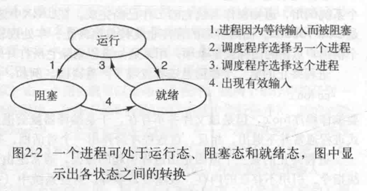

## 进程是CPU的抽象

#### 进程：运行着的程序；
###### 进程工作：将磁盘中的程序文件，加载到虚拟空间中称为程序副本，根据输入，结合副本（算法），执行后，输出；
#### 进程状态：运行态，就绪态 ，阻塞态；
###### 运行态：该时刻进程实际占用CPU；
###### 就绪态：可运行，但因为该时刻其它进程占用着CPU而暂时停止；
###### 阻塞态：除非某种外部事件发生，否则进程不能运行；



#### 进程的实现：操作系统维护了一张进程表(process table)，每一个进程都会有一个进程控制块(process control block，也称为PCB)，进程表维护所有PCB；
###### 经常使用的linux ps -ef | grep software ，其中ps 命令就是扫描进程表；

## 线程
#### 需要线程的理由：
#### 1）许多应用中，会同时发生着多种活动，其中某些活动随着时间的推移会发生阻塞，通过将这些应用程序分解成可以准并行运行的多个顺序线程，程序设计模型就会变得简单；
#### 2）线程比进程更轻量级，更容易创建和撤销；
#### 3）如果存在着大量的计算和I/O处理，拥有多个线程允许这些活动并行重叠进行；
#### 4）在多CPU系统中，多线程真正实现了并行；
#### 线程主体共享同一地址空间内的数据，而这也是多进程模型无法表达的；

## 进程间通信
#### 竞争条件：两个或多个进程读写某些共享区域，最后结果取决于进程运行的精确时序，成为竞争条件；

#### 临界区域：对共享内存进行访问的程序片段成为临界区域；
###### 1）任何两个进程不能同时处于临界区；
###### 2）不应对CPU的速度和数量做任何假设；
###### 3）临界区外运行的进程不得阻塞其它进程；
###### 4）不得使进程无限期等待进入临界区；

#### 忙互斥的等待
#### 1）屏蔽中断：CPU只有在发生时钟中断或其他中断时，才会进行进程切换，因此，可以在进程进入临界区后，屏蔽中断，离开时，再打开中断；但是这个方法不好，因为如果进程屏蔽中断后不再打开中断，整个系统将终止；如果是多核系统，则只对执行disable指令的CPU有效，其他CPU将继续执行；
#### 2）锁变量：设想有一个共享锁，进入临界区域时，检查锁变量，如果为0，则进入，为1，则说明已有某个进程进入临界区，但同样会存在因进程切换执行，而产生竞争条件的问题；
#### 3）严格轮换：连续测试一个变量知道某个值出现为止，称为忙等待，由于这种方式非常浪费CPU，所以通常应该避免，用于忙等待的锁，称为自旋锁，但容易违反竞争条件 3）；
#### 4）Peterson算法：非严格轮换算法，将锁变量和警告变量的思想结合:

```
#define FALSE 0
#define TRUE 1
#define N = 2                           /*进程数量*/

int turn;                               /*现在轮到谁？*/
int interested[N]                       /*所有值初始化为0 FALSE*/

void enter_region(int process)          /*进程0 或 1 进入了*/
{
    int other;                          /*另一个进程号*/
    other = 1 - process;                /*另一个进程*/
    interested[process] = TRUE;         /*进程表示感兴趣*/
    turn = process;                     /*设置标志*/
    while (turn == process && interested[other] == TRUE);    /*空语句*/
    
}

void leave_region(int process)          /*进程：谁离开？*/
{
    interested[process] = FALSE;        /*进程离开了临界区*/
}
```

#### 5）TSL指令：test-and-set-lock，检查并设置，不可中断的原子运算，常用于多处理器的计算机中：TSL RX,LOCK，它将一个内存字读取到寄存器RX中，然后在该内存地址上存入一个非零值，读字和写字不可分割，即该指令结束之前，其它处理器均不允许访问该n内存字，执行TSL指令的CPU会锁住内存总线，以禁止其它CPU在本指令结束之前访问内存；

```ermaid
    enter_region:
        TSL REGISTER,LOCK   | 复制锁到寄存器，并设置为1
        CMP REGISTER,#0     | 锁是零吗？
        JNE enter_region    | 若不是零，说明锁已经被设置，所以循环
        RET                 | 返回调用者，进入了临界区
            
    leave_region:
        MOVE LOCK,#0        | 在锁中存入了0
        RET                 | 返回调用者

```

#### 睡眠与唤醒
#### 忙等待在遇到进程具备优先级时，会发生意想不到的效果，例如优先级高的进程H，和优先级低的进程L，L处于临界区中，此时H处于就绪态，准备运行，现在H开始忙等待，由于调度规则规定，只要H处于就绪态，它就可以运行，因此，L不会被调度，从而无法离开临界区，H将一直忙等待；
#### 现在，换个角度，无法进入临界区时将阻塞，而不是忙等待；
#### 生产者-消费者问题，也称为有界缓冲区，两个进程共享一个公共缓冲区，生产者往缓冲区写数据，消费者从缓冲区中读取数据，缓冲区满时，生产者sleep，待消费者从缓冲区消费数据后，再唤醒生产者，同理，缓冲区空时，消费者sleep，待生产者从缓冲区中写入数据时，再唤醒消费者；

```
   #define N 100;                               /*缓冲区中的槽数目*/
   int count = 0;                               /*缓冲区中的数据项数目*/
   
   void producer()
   {
        int item;
        while (TRUE) {
            item = produce_item();              /*产生新的数据项*/
            if (count == N) sleep();            /*如果缓冲区是满的，则休眠*/
            insert_item(item);                  /*将新的数据项放入缓冲区中*/
            count += 1;                         /*数据槽中数据项数量增加1*/
            if (count == 1) wakeup(consumer);   /*缓冲区由空变非空 则唤醒消费者*/
        }
   }
   
   void consumer()
   {
        int item;
        while (TRUE) {
            if (count == 0) sleep();                /*缓冲区为空，则进入休眠状态*/
            item = remove_item();                   /*从缓冲区中获取数据项*/
            count -= 1;                             /*缓冲区中数据项数量减1*/         
            if (count == N - 1) wakeup(producer);   /*缓冲区满变非满 则唤醒生产者*/
           consume_item(item);                      /*打印数据项*/
        }
   }  
```

#### 信号量
#### 睡眠与唤醒，对count操作未加限制而产生竞争条件问题，从而导致wakeup信号丢失，缓冲区打满，生产者与消费者都陷入睡眠；
#### 因此，增加一个整型变量的信号量，维护累计唤醒次数，对外提供down和up操作，执行down操作时，检查信号量是否大于0，若大于0，则减1，并继续，若为0，则进程陷入睡眠，期间为原子操作；
#### up操作对信号量的值+1，并唤醒一个进程，