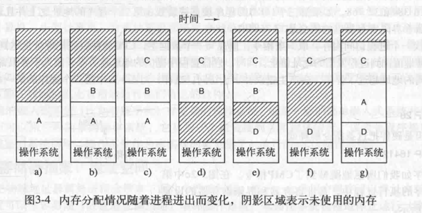
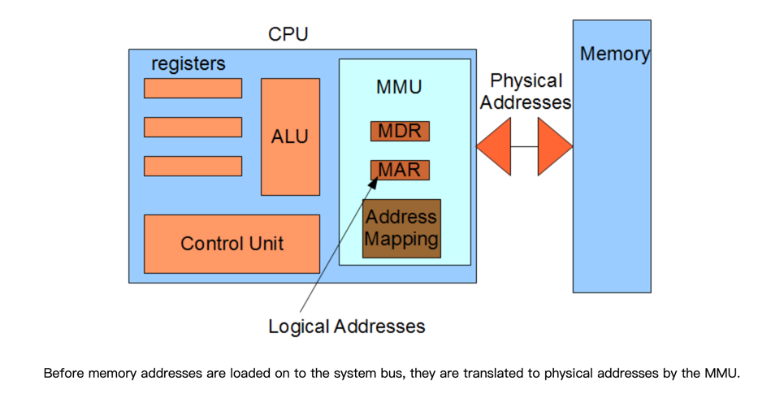
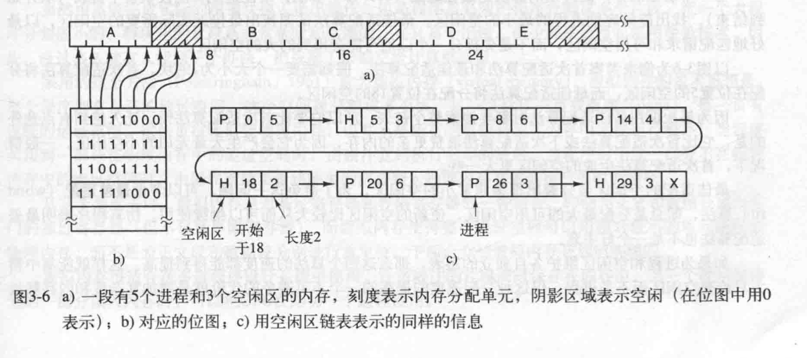

## 地址空间是内存的抽象
### 背景
#### 程序如果能直接访问内存物理地址，那么就有可能破坏操作系统，为达到安全访问内存的目的因此，可以通过地址空间的抽象，其次就是解决：∑进程所需占用内存 > 计算机物理内存；
### 具体实现
#### 地址空间：对内存进行了抽象，是进程可用于寻址内存的一套地址集合（每一个进程都有一个自己的地址空间）；
> 地址空间的概念运用非常广泛，都是用于解决安全访问和资源不足的问题；
> 例如电话号码，x86的I/O端口，IPv4的地址，域名后缀.com；
### 交换技术
##### 地址空间交换策略：进程太多，每个进程都有自己独立的地址空间，往往会发生内存超载，因此，在需要时，通过交换策略，将某个需要运行的进程完整地调入内存，使该进程运行一段时间，再存回磁盘；
> 空闲进程主要存储在磁盘上，所以当它们不运行时，主要存储在磁盘上；
> 
> 缺点：还是无法解决软件膨胀带来的内存需求激增问题，另外，如果一个进程所占内存过大，执行换入换出时，因磁盘访问速度与内存访问速度差异的问题，期间所需时间太长；

#### 重定位：将进程中变量的虚拟地址转换为物理地址；
> 简单的解决办法是动态重定位，早期是通过给CPU配置基址寄存器和界限寄存器，现代x86体系下，都是通过CPU内的MMU模块；

#### 内存紧缩：交换会导致内存中出现空洞，通过把所有的进程尽可能地往下挪，腾出一大片连续的空间，称为内存紧缩技术；

### 空闲内存管理
#### 位图法：0表示空闲，1表示占用，位图大小跟分配单元大小相关，分配单元越细，位图越大；
> 优点：简单，容易实现；
> 缺点：在决定把一个占k个分配单元的进程调入内存时，必须搜索位图，找出连续k个连续0的串，这是个耗时的操作，且，分配单元定义得越大，但进程所需空间不是分配单元的整数倍，那么就会存在一定的浪费；

#### 链表：维护一个一分配内存段和空闲内存段的链表，每个节点包含一个进程或者是两个进程间的一块空闲内存区域；
> 首次适配算法：假设存储管理器知道进程需要多少内存，遍历链表，直到找到一块足够大的空闲区，分配出进程所需内存的节点，若有剩余，形成一个新的空闲区；
> 下次适配算法：在首次适配算法的基础上，记录下空闲区位置，避免每次都从头到尾遍历；
> 最佳适配算法：遍历链表，寻找一个最接近的空闲区，而不是一找到足够大的空闲区就进行分配（缺点：会导致产生很多小空闲区）；
> 最差适配算法：即总是分配最大的空闲区，然后再其基础上，分裂出剩余空闲区；
> 缺点：这些算法都有这样一个共同的缺点，即进程被换进

### 虚拟内存
#### 每个程序拥有自己的地址空间，空间分割称多个块，每一块称作一页，每一页拥有连续的地址范围，这些页都能映射到物理内存，但并不是所有的页都在内存中，程序才能运行；

### 页面置换算法
#### 当发生缺页中断时，系统必须在内存中选择一个页面将其换出内存，以便为即将调入的页面腾出空间，换出的页面，是否需要写回磁盘，取决于该页面是否为被修改过，如果被修改过，则需要写回磁盘，否则不需要，直接新页面覆盖老页面即可；
