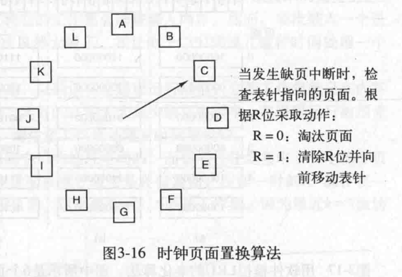
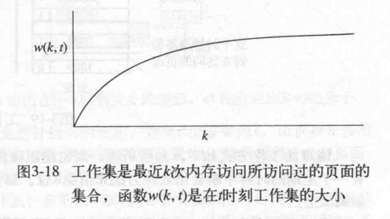

## 地址空间是内存的抽象
### 背景
#### 程序如果能直接访问内存物理地址，那么就有可能破坏操作系统，为达到安全访问内存的目的因此，可以通过地址空间的抽象，其次就是解决：∑进程所需占用内存 > 计算机物理内存；
### 具体实现
#### 地址空间：对内存进行了抽象，是进程可用于寻址内存的一套地址集合（每一个进程都有一个自己的地址空间）；
> 地址空间的概念运用非常广泛，都是用于解决安全访问和资源不足的问题；
> 例如电话号码，x86的I/O端口，IPv4的地址，域名后缀.com；
### 交换技术
##### 地址空间交换策略：进程太多，每个进程都有自己独立的地址空间，往往会发生内存超载，因此，在需要时，通过交换策略，将某个需要运行的进程完整地调入内存，使该进程运行一段时间，再存回磁盘；
> 空闲进程主要存储在磁盘上，所以当它们不运行时，主要存储在磁盘上；
> 
> 缺点：还是无法解决软件膨胀带来的内存需求激增问题，另外，如果一个进程所占内存过大，执行换入换出时，因磁盘访问速度与内存访问速度差异的问题，期间所需时间太长；

#### 重定位：将进程中变量的虚拟地址转换为物理地址；
> 简单的解决办法是动态重定位，早期是通过给CPU配置基址寄存器和界限寄存器，现代x86体系下，都是通过CPU内的MMU模块；

#### 内存紧缩：交换会导致内存中出现空洞，通过把所有的进程尽可能地往下挪，腾出一大片连续的空间，称为内存紧缩技术；

### 空闲内存管理
#### 位图法：0表示空闲，1表示占用，位图大小跟分配单元大小相关，分配单元越细，位图越大；
> 优点：简单，容易实现；
> 缺点：在决定把一个占k个分配单元的进程调入内存时，必须搜索位图，找出连续k个连续0的串，这是个耗时的操作，且，分配单元定义得越大，但进程所需空间不是分配单元的整数倍，那么就会存在一定的浪费；

#### 链表：维护一个一分配内存段和空闲内存段的链表，每个节点包含一个进程或者是两个进程间的一块空闲内存区域；
> 首次适配算法：假设存储管理器知道进程需要多少内存，遍历链表，直到找到一块足够大的空闲区，分配出进程所需内存的节点，若有剩余，形成一个新的空闲区；
> 下次适配算法：在首次适配算法的基础上，记录下空闲区位置，避免每次都从头到尾遍历；
> 最佳适配算法：遍历链表，寻找一个最接近的空闲区，而不是一找到足够大的空闲区就进行分配（缺点：会导致产生很多小空闲区）；
> 最差适配算法：即总是分配最大的空闲区，然后再其基础上，分裂出剩余空闲区；
> 缺点：这些算法都有这样一个共同的缺点，即进程被换进

### 虚拟内存
#### 每个程序拥有自己的地址空间，空间分割称多个块，每一块称作一页，每一页拥有连续的地址范围，这些页都能映射到物理内存，但并不是所有的页都在内存中，程序才能运行；

### 页面置换算法
#### 当发生缺页中断时，系统必须在内存中选择一个页面将其换出内存，以便为即将调入的页面腾出空间，换出的页面，是否需要写回磁盘，取决于该页面是否为被修改过，如果被修改过，则需要写回磁盘，否则不需要，直接新页面覆盖老页面即可；
#### 最优页面置换算法：
#### 未来一段指令周期内，最晚被访问到的页面；
> 缺点：无法实现，只存在于理论，因为操作系统无法知道；

#### 最近未使用页面置换算法（NRU-not recently used）：
#### 页表设置一个两个状态位——R(读或写)和M(修改)，进程启动时，状态位设置为0，R位被定期地清零（时钟发生中断），以区别最近没有被访问的页面和被访问的页面；
#### 当发生缺页中断时候，操作系统检查所有的页面并根据它们当前的R位和M位的值，把它们分为4类：
<li>第0类：没有被访问过，没有被修改过；</li>
<li>第1类：没有被访问过，已被修改；</li>
<li>第2类：已被访问，没有被修改；</li>
<li>第3类：已被访问，已被修改</li>

#### 算法随机地从类编号最小的非空类中挑选一个页面淘汰。在最近的一次时钟嘀嗒中，淘汰一个第1类页面，好过淘汰一个第2类页面；

#### 先进先出置换算法（FIFO——first in first out）：
#### 链表维护内存中的页面，每次缺页中断时，老页面从表头删除，新页面从表尾插入；
> 缺点：淘汰的页面，随时性太大，不好用；

#### 第二次机会页面置换算法（second chance）：
#### 在FIFO结构的基础上，页面再增加一个R位（0：该页面存在时间长且未被使用，可以立即置换 1：该页面最近被访问过）进行标识，
#### 在缺页中断发生时，如果该页面R位为0，则立即替换，若为1，则置0，并添加到表尾；
> 缺点：需要经常在链表中移动页面；

#### 时钟页面置换算法：
#### 基于second chance，将链表设置为环形，移动过指针，若页面R位为0，则立即替换，为1，则置为0，指针移动到下一个节点，直到找到一个可替换的页面；

#### 最近最少使用页面置换算法（LRU——Least Recently Used）：
#### 每次缺页中断时，置换未使用时间最长的页面；

#### 工作集页面置换算法：
> 请求调页：缺页中断发生时，系统调入该指令所需页面；
> 
> 局部性访问行为：进程运行的任何阶段，只访问较少的一部分页面；
> 
> 工作集：一个进程当前正在使用的页面的集合；
> 
> 工作集模型：在进程运行预先装入其工作集页面，减少缺页中断频率；

#### 工作集时钟页面置换算法：
#### 在工作集页面置换算法的基础上，变环形结构；

### 页面置换算法小结
<table>
    <th>算法</th>
    <th>注释</th>
    <tr>
        <td>最优算法</td>
        <td>不可实现，作为基准</td>
    </tr>
    <tr>
        <td>NRU算法</td>
        <td>LRU的粗糙近似实现</td>
    </tr>
    <tr>
        <td>FIFO</td>
        <td>可能抛弃重要页面</td>
    </tr>
    <tr>
        <td>第二次机会算法</td>
        <td>比FIFO有较大的改善</td>
    </tr>
    <tr>
        <td>时钟算法</td>
        <td>现实的</td>
    </tr>
    <tr>
        <td>LRU</td>
        <td>很优秀，但很难实现</td>
    </tr>
    <tr>
        <td>NFU（最不经常用）</td>
        <td>LRU相对粗略的近似</td>
    </tr>
    <tr>
        <td>老化算法</td>
        <td>非常近似LRU的有效算法</td>
    </tr>
    <tr>
        <td>工作集算法</td>
        <td>实现起来开销很大</td>
    </tr>
    <tr>
        <td>工作集时钟算法</td>
        <td>好的有效算法</td>
    </tr>
</table>

##### 总之，基于LRU的老化算法，和基于工作集的工作集时钟算法，在实际场景中，是可以有效实现且调度性能较好的页面置换算法；
