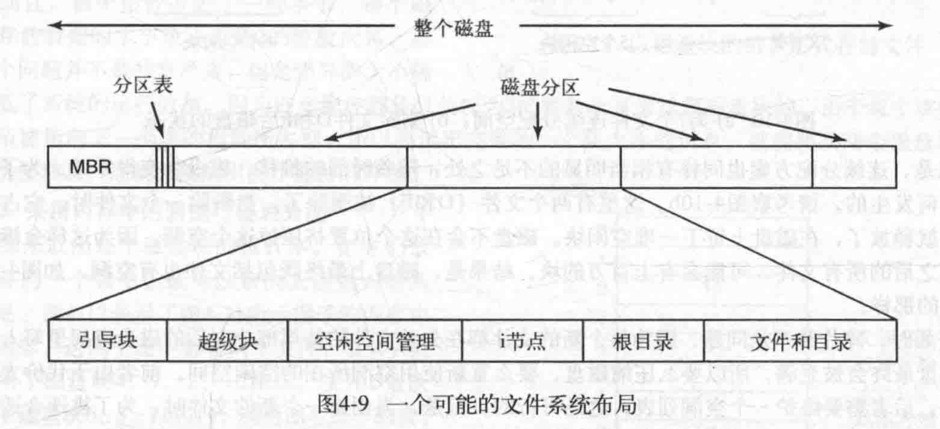

## 文件是对磁盘的抽象
### 文件
#### 1）文件的命名
#### 2）文件的结构
#### 3）文件的类型
#### 4）文件的访问
#### 5）文件的属性
#### 6）文件的操作

### 目录

### 文件系统的实现
#### 1）文件系统的布局：文件系统存放在磁盘上，多数磁盘划分为一个或多个分区，每一个分区拥有自己独立的文件系统；

> MBR：Master Boot Record，主引导记录，磁盘的0号扇区，用来引导计算机，在计算机被引导时，MBR被读入BIOS并执行，第一件事就是确定活动分区，接着读入引导块；
> 
> 分区表：记录磁盘每个分区的起始地址和结束地址；
> 
> 引导块：装载该分区中的操作系统。为统一期间，每个分区从一个引导块开始，尽管它可能不包含操作系统；
> 
> 超级块：包含文件系统的所有关键参数，超级块会被读入内存，确定文件系统类型用的魔数、文件系统中块的数量以及其他重要的管理信息；
> 
> 空闲空间管理：位图或者链表的形式给出；
> 
> i节点：以数据结构的形式存在，每文件每一个，说明了文件的方方面面；
> 
> 根目录：存放文件系统目录树的根部；
> 
> 文件和目录：磁盘上除上述区域外的文件和目录；
>

#### 2）文件的实现：

### 文件系统的管理和优化
