# 输入输出
#### 除了提供抽象（进程->CPU，地址空间->内存，文件->磁盘）之外，操作系统还要控制计算机的所有I/O（输入输出）设备，操作系统必须向设备发送命令，捕捉中断，并处理设备的各种错误，在设备和系统其它部分之间提供简单且易于使用的接口；

## I/O的硬件原理
### 块设备（block device）：
#### 有自己的地址，大小通常在 [2^9, 2^16] Byte之间，硬盘、蓝光光盘、USB盘是常见的块；

### 字符设备（character device）：
#### 以字符为单位，发送或接收一个字符流，而不考虑任何块结构，不可寻址，也没有任何块结构，打印机、网络接口、鼠标，以及大多数与磁盘不同的设备都可看作字符设备；

### 设备控制器（device controller）：
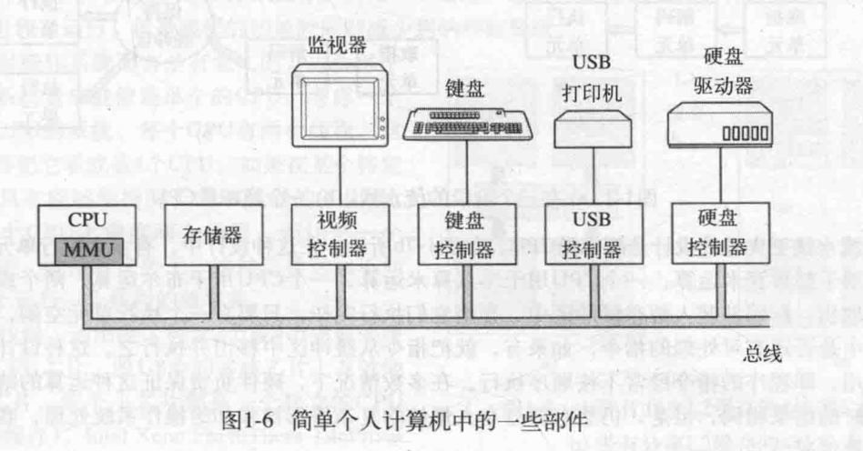
#### 位于通信总线和机械部件之间，把串行的位流转化为字节块，进行必要的错误校正工作，最后复制到对应的机械部件上； 

### 内存映射IO
#### 每个控制器，都有几个寄存器，用来与CPU进行通信，通过写入这些寄存器，操作系统可以了解设备的状态，对设备发出指令，因此，为每一个控制器分配一个I/O port，通过操作端口，可以与设备实现通信；
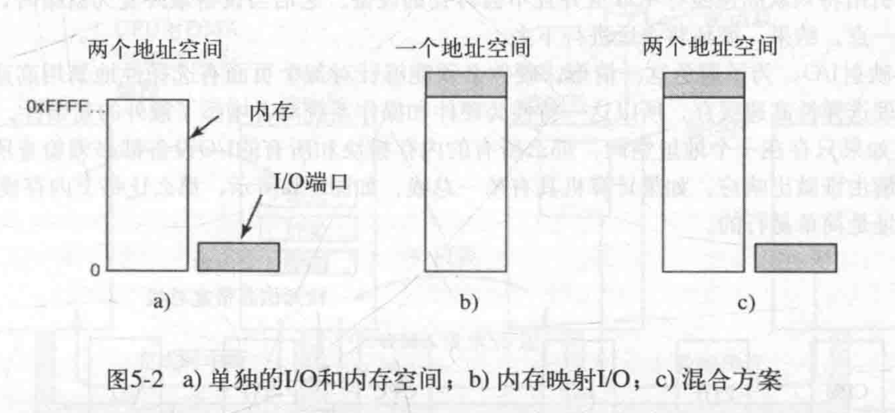

#### a）单独的IO和内存空间：大多数早期计算机，都是以这种方式工作；
#### b）内存映射IO：PDP-11引入的，每个控制器分配一个内存地址，并且不会与内存的地址冲突，这样的系统称为内存映射IO；
#### c）混合方案：x86采用这一体系结构，具有内存映射IO的数据缓冲区，而控制寄存器则具有单独的IO端口；

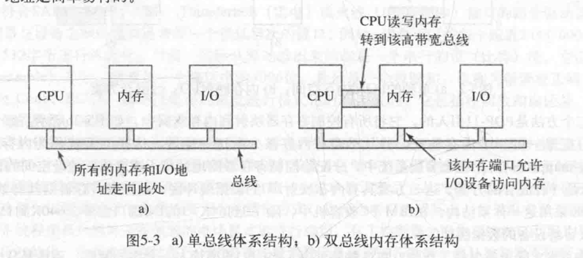

#### 现代个人计算机的趋势是包含专用的告诉内存总线，装备这一总线是为了优化内存性能，而不是为了慢速的IO设备做的折中。x86系统甚至可以有很多种总线；

### 直接存储器存取
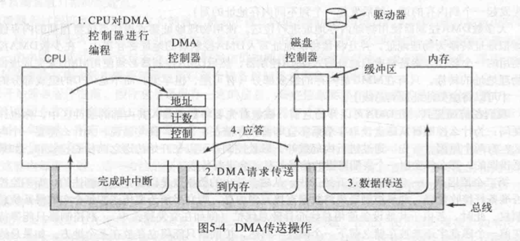

### 重温中断
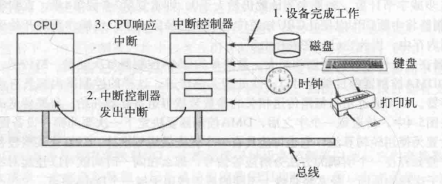

## I/O的软件原理

### IO软件的目标：
#### 设备独立性：IO软件可以访问任意IO设备而无需事先指定设备；

#### 统一命名：一个文件或一个设备的名字应该是一个简单的字符串或一个整数，不依赖于设备；

#### 错误处理：很多时候，错误能在低层软件解决，就不移交到高层软件，尽可能地在接近硬件层面去解决；

### 同步（阻塞）异步（中断驱动）

#### 缓冲：数据离开一个设备后，通常不能直接存放到最终目的地，而是存放到缓冲区中，操作系统进行检查，才知道最终放到哪里；

#### 独占设备or共享设备：磁带机，无法同时让多人使用，多个用户同时在同一磁盘上打开文件不会引起什么问题，操作系统必须能够处理独占设备和共享设备以避免问题发生；

### 程序控制IO
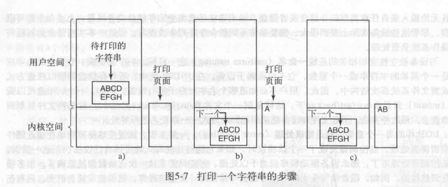

```
    copy_from_user(buffer, p, count);           /*p是内核缓冲区，从用户缓冲区buffer中拷贝指定count个字符到p缓冲区*/
    for (int i = 0; i < count; ++i) {           /*循环遍历p缓冲区*/
        while(*printer_status_reg != READY);    /*循环直至目标设备处于准备就绪状态*/
        *printer_data_register = p[i];          /*输出一个字符*/
    }
    return_to_user();                           /*切换到用户态*/
```

#### 程序控制IO的缺点：直至全部IO完成之前，CPU处于阻塞状态；

### 中断驱动IO
#### 打印机🖨️例子中，假设打印机每10ms能打印一个字符，这意味着，当每个字符被写到打印机的寄存器之后，CPU将有10ms搁置在无价值的循环中，等待允许输出下一个字符，如果允许CPU在等待打印机变为就绪状态的这段时间内做其它的事情就是使用中断；
#### a）当打印系统被调用时执行的代码：
```
    copy_from_user(buffer, p, count);
    enable_interrups();
    while (*printer_status_register != READY);
    *printer_data_register[i] = p[0];
    scheduler();
```
#### b）CPU响应中断部分：
```
    if (count == 0) {
        unblock_user();
    } else {
        *printer_data_register[i] = p[i];
        count -= 1;
        i += 1;
    }
    acknowledge_interrupt();
    return_from_interrupt();
```
#### 中断驱动IO的缺点：中断发生在每一个字符上；

### 使用DMA的IO
#### 本质上，DMA是基于程序控制IO，由DMA控制器完成字符搬运工作而不是CPU，只是这一策略需要特殊的DMA硬件，将中断次数从打印每一个字符一次，减少到打印每个缓冲区一次；
#### a）当打印系统被调用执行的代码：
```
   copy_from_user(buffer, p, count);
   set_up_DMA_controller();
   scheduler(); 
```
#### b）中断服务过程：
```
    acknowledge_interrupt();
    unblock_user();
    return_from_interrupt();
```

## I/O的软件分层
#### IO软件层次通常分为四层，每一层具有一个要执行的定义明确的功能和一个定义明确的与邻近层次的接口。功能与接口随系统的不同而不同；
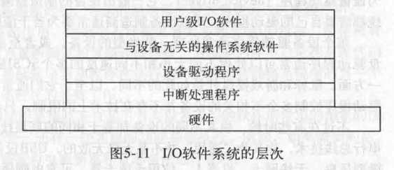
#### 中断处理程序

#### 设备驱动程序

#### 与设备无关的操作系统软件：
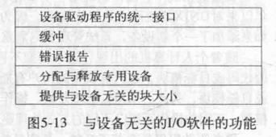
#### 1. 设备驱动程序统一接口：操作系统定义一组驱动程序必须支持的函数；
#### 2. 缓冲：数据成批运输；
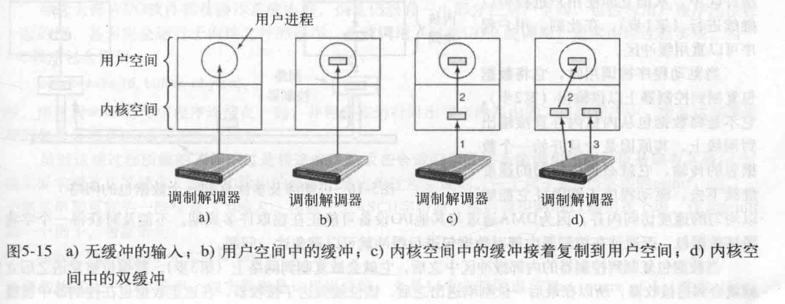
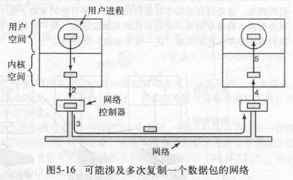
#### 3. 错误报告：取决于环境和错误的本质，无法处理则向上抛；
#### 4. 分配与释放专用设备：特殊的机制，保证设备的请求与释放有序进行；
#### 5. 提供与设备无关的块大小：某些字符设备（鼠标）一次一个字节交付数据，而其它设备（网络接口）则以较大单位交付数据，这些差异需要由设备无关的软件，对高层软件隐藏起来，提供一个统一的块大小；

#### 用户空间的IO软件：
#### 完全运行在内核之外，且可以与与用户程序连接在一起使用函数；

### IO软件分层小结
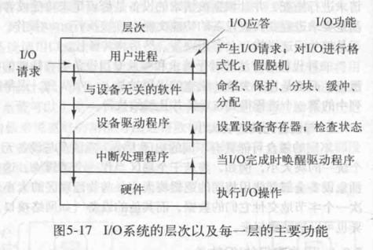
#### 用户进程想要读取磁盘的某个块，操作系统被调用以实现这一请求，与设备无关的软件在缓冲区中查找这一块，如果不在，则调用设备驱动程序，向硬件发起一个请求，让它从磁盘中读一个块；
#### 进程被阻塞，直到磁盘操作完成并且数据在调用者的缓冲区中安全可用；
#### 硬盘完成操作时，产生一个中断，中断处理程序会运行，从设备提取信息，唤醒休眠的IO进程，以结束此次IO请求，用户进程继续运行；


## 盘
## 时钟
## 用户界面：键盘、鼠标、监视器
## 电源管理
