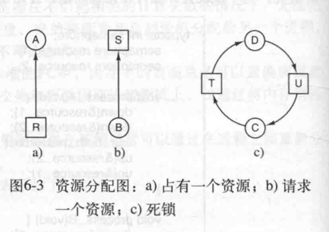
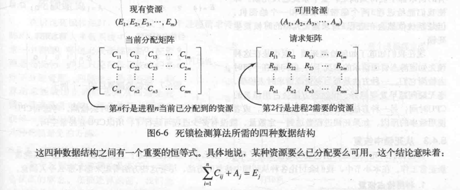

## 死锁
#### 死锁的定义：如果一个进程集合中，每个进程都在等待只能由该进程集合中的其它进程才能引发的事件，那么，该进程集合就是死锁的；
#### 死锁发生的四个必要条件：
#### 1）互斥条件：每个资源要么已经分配给了一个进程，要么就是可用的；
#### 2）占有和等待条件：已经得到了某个资源的进程可以再请求新的资源；
#### 3）不可抢占条件：已经分配给一个进程的资源不能强制性地被抢占，它只能被抢占它的进程释放；
#### 4）环路等待条件：死锁发生时，一定有由两个或两个以上的进程组成的一条环路，该环路中的每个进程都在等待下一个进程所占有的资源； 

#### 死锁建模如下，圆形代表进程，方形代表资源：



### 死锁检测算法：
#### 矩阵算法：定义E(existing resource vector)为现有资源向量，代表现有资源集合，A(available resource vector)为可用资源向量，代表可分配的资源结合，P代表进程集合，Pi代表第i个进程；
#### 此时还需要两个数组：C(current allocation matrix)代表当前分配矩阵，R(request matrix)代表待分配矩阵；
#### 其中Cij代表：进程Pi所持有的资源j的数量，Rij代表：进程Pi所需要资源j的数量；
#### 对于任意资源j存在于E中，且资源j要么处于已分配，要么处于可用状态；
#### 换而言之，如果将所有矩阵C中，已分配资源j的数量，加上集合A中，可分配资源的数量，结果就是资源集合E的总和；


```
    #define i 3                                         /*进程数量为3个*/
    #define j 4                                         /*资源种类为4种*/
    int[] E = {4,2,3,1};                                /*每种资源的数量*/
    int[] A = {2,1,0,0};                                /*每种资源剩余可分配数量*/
    int[][] C = new int[i][j];                          /*Cij代表 第i个进程，第j种资源已占有的数量*/
    int[][] R = new int[i][j];                          /*Rij代表 第i个进程，第j种资源欲请求的数量*/
    
    void request_allocation(int i, int j, int num) {    /*第i个进程，请求分配第j个资源，数量为num*/
        int total_j = num;                              /*资源j欲分配数量，已占用数量，可分配数量总和*/
        for (int a = 0; a < i; ++a) {
            total_j += C[a][j];
            total_j += R[a][j];
        }
        if (total_j > E[j]) {                           /*资源j总数量之和如果大于资源最大数量，则返回，不分配*/
            return;
        }
        if (num <= A[j]) {                              /*判断资源j的请求分配量 是否<=待分配数量？*/
            C[i][j] += num;                             /*执行分配*/
            A[j] -= num;                                /*资源j可分配数量减少*/
        } else {
            R[i][j] += num;                             /*数量大于可分配，则进入请求分配矩阵中*/
        }
    }
    
    void release_allocation(int i, int j, int num) {    /*第i个进程，释放第j个资源，数量为num*/
        // 
    }
    
    bool check_if_dead_lock_exist(void) {
        bool deadLock = false;
        while (TRUE) {
           // todo     
        }
        return dead_lock;
    }
```
