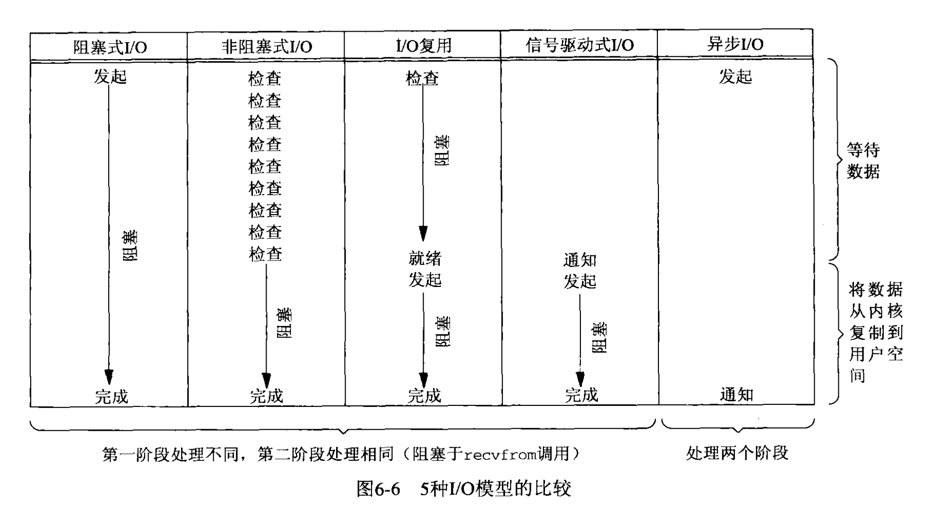

#  unix5种IO模型
##  对于Unix来说，有5种IO模型
### 阻塞IO：应用进程发起读操作，切换到内核，一直等待内核准备好，内核将文件拷贝到应用进程，返回数据，整个过程用户进程一直阻塞。

### 非阻塞IO：相较于阻塞IO，应用进程对阻塞IO做的改进是，定期去轮询内核，文件是否准备好，直到最后一次轮询到内核已将文件准备就绪，便取回文件。

### 信号驱动IO：相较于非阻塞IO，应用进程对非阻塞IO做的改进是，不去轮询轮询，而是等待内核将数据准备好，通过一个信号，通知应用进程文件已准备就绪，进程再去获取文件。

### IO复用：应用进程将一组IO请求注册的管道中，管道再统一跟内核进行交互，应用进程会调用这个管道，如果管道没有数据就绪的IO，就会一直阻塞，有就把数据取回来。

### 以上四种，全是同步IO，例如信号驱动IO，虽然应用进程取数据过程中是非阻塞的，但内核准备数据的过程中依然是同步的，因此整个过程不能视为异步。

### 异步IO：应用进程调用aio_read()操作之后，给内核传递了描述符、缓存指针、缓存空间大小，由内核去完成数据准备，再把数据拷贝到用户空间，最后通知应用进程数据就绪。

### 总结
### 阻塞非阻塞指的是调用方，调用方需要在被调用方返回数据之前，一直等待，则称为阻塞，调用方可以去处理别的事情，则称之为非阻塞。
### 同步异步指的是被调用方，被调用方收到调用方信息后，将数据准备完，再通知调用方，则是同步，被调用方收到信息后，先返回，再去准备数据，最后再通知调用方，则称为异步。

## 对于Java来说，对操作系统的IO模型进行了封装，提供BIO，NIO，AIO三种模型
### BIO：同步阻塞，客户端的socket绑定服务端的thread，相当于每线程每连接，优点是编码简单，ServerSocket 与 Socket，适合连接数少，连接时间长的应用，但缺点是太占用线程，通常通过自定义线程池来优化。
### NIO：同步非阻塞，客户端的socket通过channel与服务端的selector绑定，再注册到ServerSocketChannel中，服务端通过轮询SelectorKey中的事件是否

## 零拷贝的实现 （具体参考 捡田螺的小男孩 所写）
### 首先要理清，文件的访问横跨三个层，应用层（用户进程），内核层（操作系统调用），外设层（磁盘，网卡），应用层与内核层的交互依赖于cpu，具体方式是调用操作系统函数，内核层与外设层的交互依赖于DMA（一颗独立运行的新片，可以看成功能专一的cpu）
### 举个🌰，通过网络发送文件，应用层进程调用系统readFile，此时从用户态切换到内核态，cpu通知DMA去磁盘读取文件，将内容拷贝到内核缓冲区，cpu再将内核缓冲区数据拷贝到用户缓冲区，此时又进行了一次上下文切换，应用进程再调用系统writeFile，cpu切换到内核态，并将用户进程的缓冲区拷贝到内核socket文件，再通知dma将socket文件写到网卡，最后cpu切换到应用层通知用户进程执行结果，该过程一共经历了4次cpu上下文切换，2次cpu拷贝，2次DMA拷贝；

### 减少cpu切换次数，和拷贝次数，是提升性能的一个标准
### mmap函数 + write函数，基于虚拟化内存原理，提供给应用层，砍掉了cpu将数据拷贝到应用层缓冲区的过程；
### sendFile函数，砍掉了cpu切换到应用层的次数，但还是需要将内核缓冲区的数据拷贝到socket缓冲区
### 带sendFile功能的DMA的出现，cpu不再需要数据拷贝，只需要将内核缓冲区的地址和偏移量映射到socket上，再通知DMA将数据写到网卡，至此，cpu实现零拷贝
