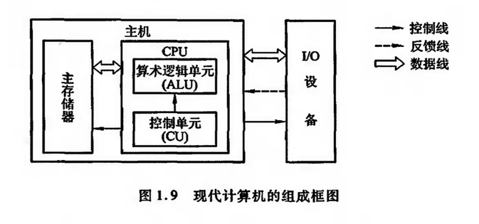

#### 冯诺伊曼计算机特点：
###### 由五大部件组成：输入设备，运算器，控制器，存储器，输出设备；
###### 以运算器为中心，输入输出设备与存储器间的数据传送通过运算器完成；
###### 指令和数据同等放置在存储器中，并可按地址寻访；
###### 指令和数据均用二进制表示；
###### 指令：操作码 + 地址码；地址码可用于表示数据存放在存储器中的地址；
###### 指令在存储器内按顺序存放。通常，指令是顺序执行，在特定条件下，可按照运算结果或根据设定的条件改变顺序；

#### 现代计算机主要以存储器为中心，图形如下；

###### 存储器：存放数据和程序；
###### 运算器：完成算数运算和逻辑运算；
###### 控制器：控制、指挥程序的输入、运行以及处理运算的结果；
###### 输入设备：将人们熟悉的信息形式转换为机器能识别的信息形式，常见的有键盘、鼠标；
###### 输出设备：将机器的运算结果转换为人们熟悉的信息形式，如打印机输出、显示器输出等；
###### 计算器的五大部件，在控制器的作用下有条不紊地运行；

#### 由于运算器跟控制器在逻辑关系和电路上紧密联系，尤其在大规模集成电路制作工艺出现之后，这两大部件常常在一个芯片上，因此，通常合起来称之为中央处理器（Central Processing Unit, CPU）;
#### 输入设备跟输出设备简称为I/O设备（Input/Output Equipment）;
#### 至此，现代计算机由三大部件组成：CPU，I/O设备，主存储器；
#### CPU和主存储器合起来称之为主机，I/O设备称之为外部设备；

#### 由上图可见，不仅仅是ALU单元跟主存储器，I/O设备也受CU单元控制，因此计算机能有条不紊地工作都是在控制器的统一指挥下完成的；

#### 计算机组成结构细化如下：
#### MDR：memory data register，存储器数据寄存器，用来存放欲访问的存储单元的地址，其位数对对应存储单元的个数（如MAR为10位，则有2^20 = 1024个存储单元，记位1K）；
#### MAR：memory address register，存储器地址寄存器，用来存放从存储体某单元取出的代码或准备往存储体某单元存入的代码；
#### 控制器的作用: 计算机的神经中枢，首先从存储体取出一条指令（取指阶段），接着分析该指令要完成什么样的操作，并按寻址特征指明操作数的位置，称为分析阶段，最后根据操作数所在的地址以及指令的操作码完成某种操作，称为执行阶段；
#### 控制器的组成：由程序计数器（Program Counter PC）、指令寄存器（Instruction Register IR）以及控制单元（Control Unit CU）组成；
#### PC：存放当前欲执行指令的地址；
#### IR：当前的指令；
#### CU：分析当前指令所需完成的操作，并发出各种微操作命令序列，用以控制所有被控对象；

