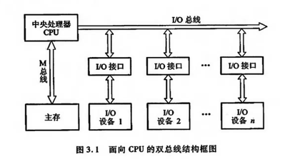

# 系统总线
### 总线结构功能
#### 背景：早期计算机各部件大多采用分散连接方式，无法满足随时增添设备的需求，因此需要总线；
#### 总线定义：
#### 1）连接多个部件的信息传输线，是各部件共享的传输介质；
#### 2）某一时刻，只允许一个部件向总线发消息，但却可以允许多个部件同时向总线读消息；
#### 3）由许多条传输线或通路组成，每条线可一位一位地传输二进制代码；

#### 双总线结构：

#### 单总线结构：

#### 以存储器为核心的双总线结构：

### 总线的分类
#### 片内总线：CPU内部，寄存器之间，寄存器与ALU之间，都由片内总线连接；

#### 系统总线：又称为板级总线（在一块电路板上各芯片间的连线），CPU、主存、I/O设备之间各大部件的信息传输线；
#### 根据传输内容不同，又分类三类总线：控制总线、地址总线、数据总线；
#### 1）数据总线：各功能部件之间双向传输数据信息，数据总线的位数称为数据总线宽度，是衡量系统性能的一个重要参数，如果数据总线宽度为8位，指令字长位16位，那么CPU在取指阶段，就需要访问主存2次；

#### 2）地址总线：存放CPU欲访问的资源的地址，单向传输，地址线的位数与存储单元的大小有关，地址线的根数位20，存储单元的个数则位2^20；

#### 3）通信总线：用来发出各种控制信号的总线，对于CPU而言，控制总线既有输出也有输入；
###### 常见控制信号：
###### 时钟：用来同步各种操作。
###### 复位：初始化所有部件；
###### 总线请求：表示某部件需要获取总线使用权；
###### 总线允许：表示需要获取总线使用权的部件已获得了控制权；
###### 中断请求：表示某部件提出中断请求；
###### 中断响应：表示中断请求已被接收；
###### 存储器写：将数据总线上的数据写至存储器的指定地址单元内（地址总线上获取地址）；
###### 存储器读：从指定存储单元中的数据读取到数据总线上；
###### I/O写：将数据总线上的数据写到指定的I/O端口内；
###### I/O读：从指定的I/O端口上将数据读取到数据总线上；
###### 传输响应：表示数据已被接收，或者数据已传输到数据总线上；

#### 通信总线：这类总线用于计算机系统与其它系统之间数据传输，按数据传输方式可分为串行通信和并行通信；

### 总线控制
#### 背景：总线上连接着多个部件，存在着多个部件同时发送信息，丢失信息，规定哪个部件接收信息等问题，需要有一个总线控制器，它包括判优和通信控制；
#### 总线判优控制：

#### 总线通信控制：