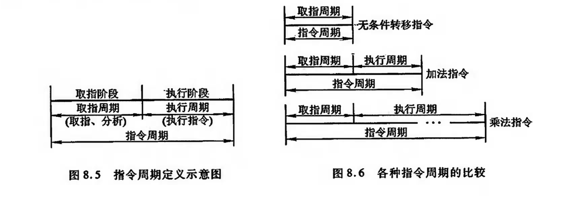
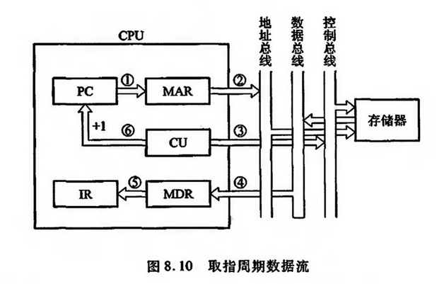
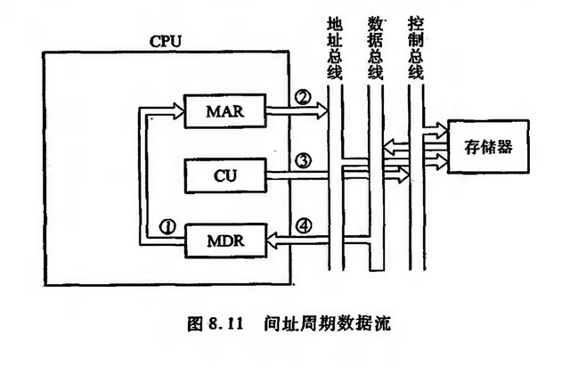
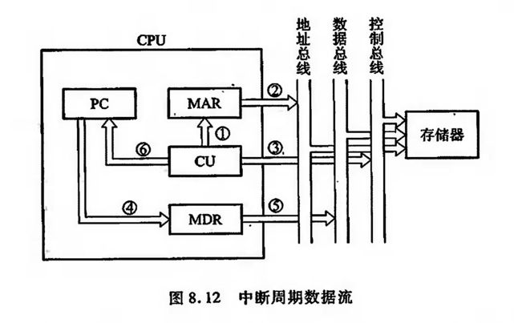
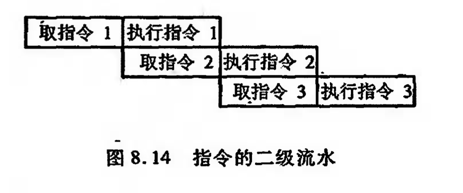

## CPU的结构和功能
#### CPU执行一条指令的过程，以及为了提高数据的处理能力、开发系统的并行性所采取的流水线技术；
#### 控制器的主要功能：取指令，分析指令，执行指令；
#### CPU内部结构功能图：

### CPU的寄存器
### 1.用户可见寄存器：
#### 1）通用寄存器：可用于存放操作数；
#### 2）数据寄存器：存放操作数；
#### 3）地址寄存器：存放地址；
#### 4）条件码寄存器：存放条件码；

### 2.控制和状态寄存器：
#### 1）MAR：存储器地址寄存器：用于存放被访问的存储单元的地址；
#### 2）MDR：存储器数据寄存器：用于存放欲存入存储器中的数据或最近从存储器中读出的数据；
#### 3）PC：程序计数器：存放当前指令的地址；
#### 4）IR：指令寄存器：存放当前欲执行的指令；
#### 通过以上4个寄存器，CPU可与主存交换信息，例如，将现行指令地址从PC送至MAR，启动存储器读操作，存储器就可将指定地址单元内的指令读至MDR内，再由MDR送至IR；

### 指令周期

#### 指令周期：CPU取出并执行一条指令所需的全部时间称为指令周期，如下图，不同指令周期：

#### 取指周期数据流：
#### 1）PC中存放的现行指令的地址，送至MAR；
#### 2）MAR将指令送地址总线；
#### 3）CU通过控制总线，向存储器发起读命令；
#### 4）存储器通过数据总线，将MAR对应的数据送至MDR，再送至IR；
#### 5）CU控制PC内容加1，形成下一条指令的地址；

#### 间接寻址：取指周期，间址周期，执行周期；
#### 1）一旦取指周期结束，CU便检查IR中的内容，以确定其是否有间址操作；
#### 2）如果需要间址周期，则MDR中指示形式地址的右N位将被送到MAR；
#### 3）又送至地址总线；
#### 4）此后CU通过控制总线，向存储器发送读命令，以获取有效地址并存至MDR；

#### 中断：取指周期，间址周期，中断周期，执行周期；
#### 1）CU把用于保存程序断点的存储器特殊地址（如栈指针的内容）送往MAR，并送至地址总线；
#### 2）然后由CU通过控制总线，向存储器发起写命令，并将PC中的内容送至MDR；
#### 3）最终使程序断点经数据总线存入存储器；
#### 4）此外，CU还需将中断服务程序的入口地址送至PC，为下一个指令周期的取指周期做好准备；

### 指令流水
#### 指令流水的原理：指令大致分为【取指令】和【执行指令】两个动作，周而复始，在【执行指令】的同时，取出下一条指令，称为指令流水，像这样重叠的指令操作，称为二级指令流水，如下图：

#### 指令流水效率无法成倍增加，受限于：
#### 1）【执行指令】阶段所需花费的时间远大于【取指令】阶段；
#### 2）当遇到条件转移指令时，下一步是不可预知的，因此必须等到执行阶段结束后，才能获知条件是否成立，从而决定下一条指令的地址，造成时间损失；

####
