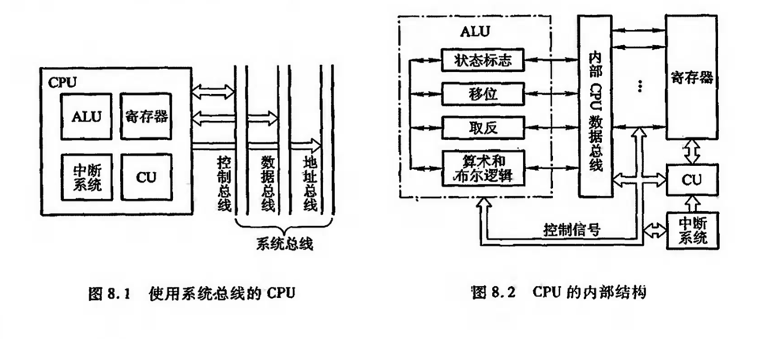
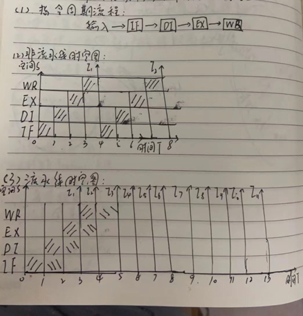
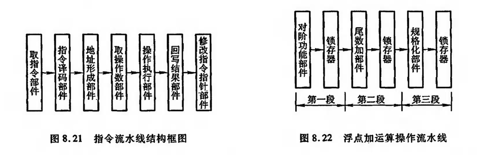

## CPU的结构和功能
#### CPU执行一条指令的过程，以及为了提高数据的处理能力、开发系统的并行性所采取的流水线技术；
#### 控制器的主要功能：取指令，分析指令，执行指令；
#### CPU内部结构功能图：

### CPU的寄存器
### 1.用户可见寄存器：
#### 1）通用寄存器：可用于存放操作数；
#### 2）数据寄存器：存放操作数；
#### 3）地址寄存器：存放地址；
#### 4）条件码寄存器：存放条件码；

### 2.控制和状态寄存器：
#### 1）MAR：存储器地址寄存器：用于存放被访问的存储单元的地址；
#### 2）MDR：存储器数据寄存器：用于存放欲存入存储器中的数据或最近从存储器中读出的数据；
#### 3）PC：程序计数器：存放当前指令的地址；
#### 4）IR：指令寄存器：存放当前欲执行的指令；
#### 通过以上4个寄存器，CPU可与主存交换信息，例如，将现行指令地址从PC送至MAR，启动存储器读操作，存储器就可将指定地址单元内的指令读至MDR内，再由MDR送至IR；

### 指令周期

#### 指令周期：CPU取出并执行一条指令所需的全部时间称为指令周期，如下图，不同指令周期：

#### 取指周期数据流：
#### 1）PC中存放的现行指令的地址，送至MAR；
#### 2）MAR将指令送地址总线；
#### 3）CU通过控制总线，向存储器发起读命令；
#### 4）存储器通过数据总线，将MAR对应的数据送至MDR，再送至IR；
#### 5）CU控制PC内容加1，形成下一条指令的地址；

#### 间接寻址：取指周期，间址周期，执行周期；
#### 1）一旦取指周期结束，CU便检查IR中的内容，以确定其是否有间址操作；
#### 2）如果需要间址周期，则MDR中指示形式地址的右N位将被送到MAR；
#### 3）又送至地址总线；
#### 4）此后CU通过控制总线，向存储器发送读命令，以获取有效地址并存至MDR；

#### 中断：取指周期，间址周期，中断周期，执行周期；
#### 1）CU把用于保存程序断点的存储器特殊地址（如栈指针的内容）送往MAR，并送至地址总线；
#### 2）然后由CU通过控制总线，向存储器发起写命令，并将PC中的内容送至MDR；
#### 3）最终使程序断点经数据总线存入存储器；
#### 4）此外，CU还需将中断服务程序的入口地址送至PC，为下一个指令周期的取指周期做好准备；

### 指令流水
#### 指令流水的原理：指令大致分为【取指令】和【执行指令】两个动作，周而复始，在【执行指令】的同时，取出下一条指令，称为指令流水，像这样重叠的指令操作，称为二级指令流水，如下图：

#### 指令流水效率无法成倍增加，受限于：
#### 1）【执行指令】阶段所需花费的时间远大于【取指令】阶段；
#### 2）当遇到条件转移指令时，下一步是不可预知的，因此必须等到执行阶段结束后，才能获知条件是否成立，从而决定下一条指令的地址，造成时间损失；
#### 这里CPU使用了猜测法，即当条件指令从取指进入分析阶段时，CPU仍按顺序读取下一条指令，如果条件不成立，转移没发生，则没有时间损失；若条件成立，转移发生，则所取的指令必须丢掉，再取新的指令；

#### 指令的处理过程细化为更细的几个阶段：
#### 1）取指（FI）：fetch instrument，从存储器取出一条指令并暂时存入指令部件的缓冲区；
#### 2）指令译码（DI）：decorate instrument，确定操作性质和操作数地址的形成形式；
#### 3）计算操作数地址（CO）：compute operate data address，计算操作数的有效地址，设计寄存器间接寻址、间接寻址、变址、基址、相对寻址等各种地址计算方式；
#### 4）取操作数（FO）：fetch operate data，从存储器中取操作数（如果操作数在寄存器中，则无此操作）；
#### 5）执行指令（EI）：execute instrument，执行指令所需的操作，并将结果存于寄存器中；
#### 6）写操作数（WO）：write operate data，将结果写入存储器；

### 影响流水线性能的三大因素：
#### 1）结构相关：指令重叠执行过程中，不同指令争用同一功能部件产生资源冲突时产生的；
#### 解决方法：指令预取技术，预先取出指令，存放到指令队列；

#### 2）数据相关：流水线中的各条指令因重叠操作，可能改变对操作数的读写访问，从而导致了数据冲突；
#### 解决方法：旁路技术，不必等待某条指令的执行结果送回寄存器后，再从寄存器取出该结果，作为下一条寄存器的源操作数，而是直接将执行结果送到其它指令所需要的地方；

#### 3）控制相关：主要是由转移指令引起的，
#### 解决方法：尽早判别转移是否发生，尽早生成转移目标地址，预取转移成功或不成功两个控制流方向上的目标指令；加快和提前形成条件码，提高转移方向的猜测率；

### 流水线性能衡量指标
#### 1）吞吐率：在指令级流水中，单位时间内流水线所完成指令或输出结果的数量；
#### 2）加速比：m段流水线的速度与等功能的非流水线的速度之比；
#### 3）效率：流水线中，各功能段的利用率；

#### 例题，假设指令流水线分取指（IF）、译码（DI）、执行（EX）、回写（WB）4个过程段，共有10条指令连续输入此流水线。
#### （1）画出指令周期流程；
#### （2）画出非流水线时空图；
#### （3）画出流水线时空图；

#### （4）假设时钟周期为100ns，求流水线的吞吐率（执行每条指令所需要的时间）；
#### 答：由上图可知，流水线10条指令所需时钟周期个数为13，每个时钟周期为100ns，则每条指令所需时间，即吞吐率：10 / （100 * 13）约等于 0.77 * 10 ^ -2 条指令/纳秒；
#### （5）求该流水线的加速度比（非流水线下和流水线下，指令的执行周期的区别）；
#### 答：非流水线处理10条指令，需要4 * 10 = 40个时钟周期，流水线处理10条指令，需要13个时钟周期，因此，加速度比为 40 / 13 约等于 3.08；

### 流水线中的多发技术
#### 目的：在一个时钟周期内，产生更多条指令的结果；
#### 常见多发技术：超标量技术、超流水线技术、超长指令字技术，多发技术的实现，主要依赖于有相关硬件支撑；

### 流水线结构

### 中断系统
#### 1）采用中断，实现CPU与I/O交换信息时，CPU与I/O能并行工作，提高CPU的效率；（提高效率）
#### 2）除了I/O中断外，还会有许多意外发生，比如随机抽查计算的中间结果，实现人机联系，或者，工控系统中，温度过高、电压过大等情况，必须及时送至计算机，由计算机暂时中断程序运行，转去执行中断服务程序，以解决这种异常情况；（实时控制）
#### 3）再比如，计算机实现多道程序作业运行时，可以通过分配给每道作业一个固定的时间片，利用时钟定时发生中断进行程序切换；（多道程序作业）
#### 4）在多处理机系统中，各处理器间的信息交流和任务切换也可以通过中断来实现；（多处理机）

#### 中断系统解决的问题：
#### 1）各中断源如何向CPU提出中断请求：
#### 答：设置中断请求触发器，在需要CPU服务时，将中断请求置位作为请求信号；

#### 2）当多个中断源同时提出中断请求时，中断系统如何确定优先响应哪个中断源的请求：
#### 答：硬件设计，和软件设计均可实现中断优先级排队；

#### 3）CPU在什么条件、什么时候、什么方式来响应中断：
#### 条件：中断请求源置位（中断置位），该中断源未被屏蔽（中断允许），该中断请求在当前所有中断请求中级别最高（中断级别最高），CPU现行指令执行完；
#### 时间：CPU在每一个指令周期的最后一个时钟周期的开始开始采样中断请求输入线（思路如此，但实际并不采用，毕竟有些指令可能因执行周期过长，进而错过响应中断的时机），若有中断请求，则下一步不进入取指令周期，而进入中断响应周期；
#### 响应：CPU在某些指令执行过程中设置中断查询点，进而在每个"查询断点"的时刻发出中断查询信号，发现便及时响应；

#### 4）CPU响应中断后，如何保护现场：
#### 保护程序断点，将当前程序PC的内容保存到存储器；
#### 保护CPU内部各寄存器的内容，将当前CPU内各寄存器的内容保存到存储器；

#### 5）CPU响应中断后，如何停止原程序的执行而转入中断服务程序的入口：
#### 保护现场，通过硬件向量法或者软件查询法，寻找中断服务程序入口地址，进而执行中断服务程序；

#### 6）中断处理结束后，CPU如何恢复现场，如何返回到原程序的间断处：
#### 恢复现场由中断服务程序完成； 

#### 7）在中断处理过程中又出现了新的中断请求，CPU该如何处理：
#### 多重中断；

#### 要解决以上7个问题，需配置响应的硬件和软件；

### 中断屏蔽技术
#### 主要应用于多重中断；
#### 多重中断的定义：当CPU执行某个中断服务程序时，另一个中断源又提出了新的中断请求，而CPU又响应了这个新的请求，暂时停止正在运行的服务程序，转而去执行新的中断服务程序，这称为多重中断，又称为中断嵌套；
#### 多重中断的条件：
#### 1）提前设置'开中断'指令，
#### 2）优先级别高的中断源有权中断优先级别低的中断源；

#### 触发器屏蔽技术：保证级别低的中断源不干扰级别高的中断源的处理过程；