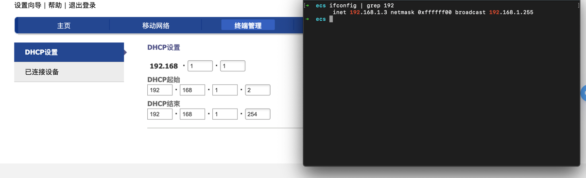
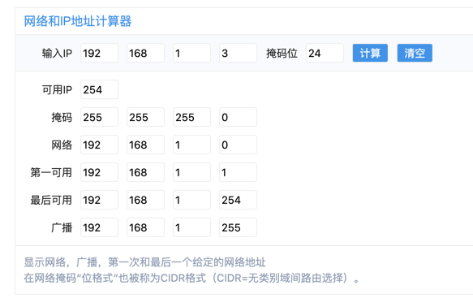

#### 网络层：主要协议是IP协议，不提供服务质量的保证，不保证分组交付的时限，所传送的分组可能出现出错、丢失、重复和失序；
#### 网络层提供两种服务：虚电路服务，数据报服务，互联网上基本使用数据报服务；
#### 虚电路服务：虚拟电路，主机之间通信，必须在事先建立的虚拟电路上进行；
#### 数据报服务：简单灵活、无连接，尽最大努力交付数据；
<table>
    <th>对比方面</th>
    <th>虚电路服务</th>
    <th>数据报服务</th>
    <tr>
        <td>思路</td>
        <td>可靠通信由网络来保证</td>
        <td>可靠通信由用户主机来保证</td>
    </tr>
    <tr>
        <td>连接的建立</td>
        <td>必须有</td>
        <td>不需要</td>
    </tr>
    <tr>
        <td>终点地址</td>
        <td>仅在连接建立时需要，每个分组都采用极短的虚拟电路号</td>
        <td>每一个分组都会带上终点的完整地址</td>
    </tr>
    <tr>
        <td>分组的转发</td>
        <td>属于同一条虚电路上的转发均经过同一条路由</td>
        <td>每个分组都独立选择路由进行转发</td>
    </tr>
    <tr>
        <td>当结点出故障时</td>
        <td>所有出故障出故障结点的虚电路均不能工作</td>
        <td>当故障的结点属于分组时，可能会出现分组丢失，一些路由可能发生变化</td>
    </tr>
    <tr>
        <td>分组的顺序</td>
        <td>总是按发送顺序到达</td>
        <td>到达终点的时间不一定按发送顺序</td>
    </tr>
    <tr>
        <td>端到端的流量差错处理和流量控制</td>
        <td>可以由网络负责，也可以由用户主机负责</td>
        <td>由用户主机负责</td>
    </tr>
</table>

#### IP协议：IP网是虚拟的，统一、抽象的网络（实际上是有许多协议异构的），屏蔽了下层网络很复杂的细节，使我们能够使用统一、抽象的IP地址处理主机间的通信；
#### 数据交付方式：直接交付——在本网络直接交付；间接交付：通过路由器，交付到其它网络中；
#### 数据转发：单个路由器的动作；
#### 路由选择：多个路由器共同协作的过程，相互交换信息，目的是生成路由表；

<table>
    <th>名称</th>
    <th>含义</th>
    <th>计算方式</th>
    <tr>
        <td>IP地址</td>
        <td>可划分为：网络地址 + 主机地址</td>
        <td>可借助子网掩码，按位与，拆分出网络地址和主机地址</td>
    </tr>
    <tr>
        <td>子网掩码（又称为IP掩码）</td>
        <td>用于确认一个IP地址的网络部分和主机部分</td>
        <td>32位二进制，用于和IP地址进行按位与，拆分网络地址和主机地址</td>
    </tr>
    <tr>
        <td>网络地址</td>
        <td>包含网络地址，但不包含主机地址，用于唯一标识一个网络，在网络通信中，用于路由和寻址</td>
        <td>同上</td>
    </tr>
    <tr>
        <td>广播地址</td>
        <td>在特定网络上，发送广播消息的地址。用于向网络上所有设备发送信息。</td>
        <td>通常是最大的那个地址，主机号全部为1</td>
    </tr>
</table>

关于网络地址、广播地址等计算工具 [站长工具](https://tool.chinaz.com/tools/subnetmask)

#### 如上图所示，根据IP地址 192.168.1.3 子网掩码为255.255.255.0
#### 可计算出 网络地址为：192.168.1.0/24 (CIDR格式)
#### 广播地址：网络位不变，主机位全置为1：192.168.1.255
#### 因此，可用于分配的主机号：2^(32 - 24) - 2 = 254 (其中，2是被预定的网络地址和广播地址)
#### 在上图中，192.168.1.1 已被分配，用于DHCP

