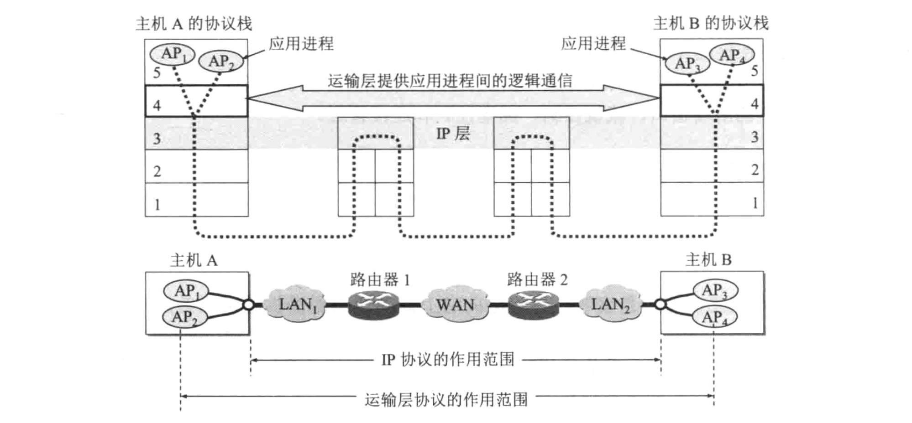
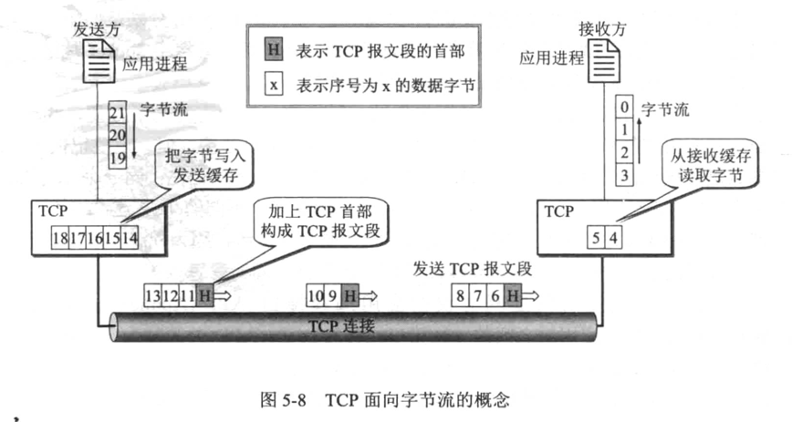
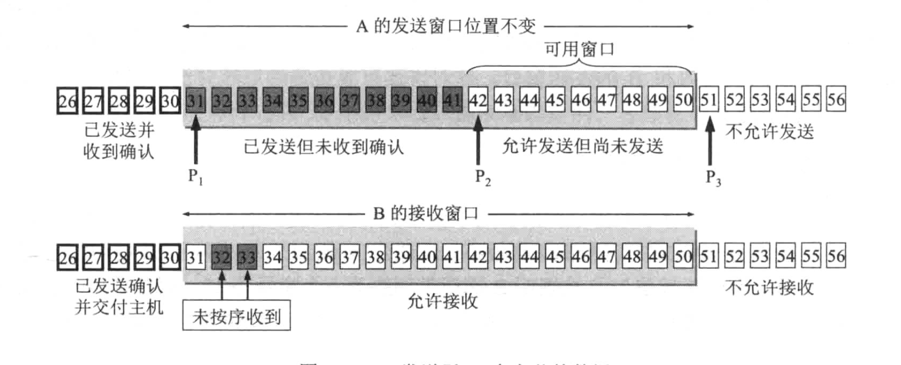
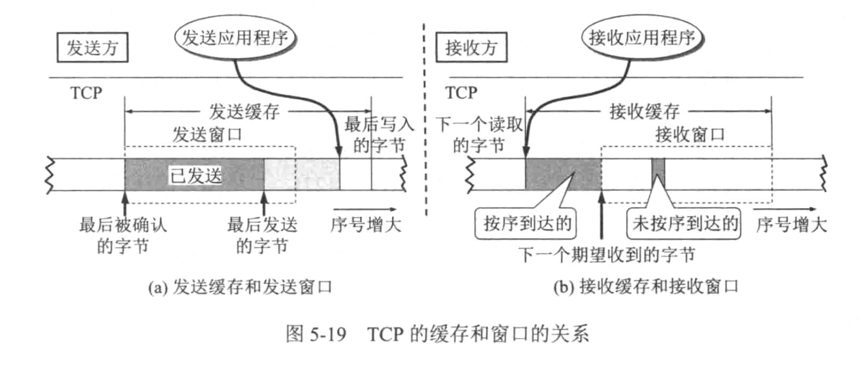

#### 运输层：主要协议是TCP协议（UDP协议），向应用层提供通信服务，保证进程之间通信的可靠运输；
#### 运输层功能：分用和复用，可以同时为主机上的不同进程提供准确通信；

<table>
    <th>模型层级</th>
    <th>通信端点</th>
    <th>主要功能</th>
    <th>通信类型</th>
    <th>连接方式</th>
    <tr>
        <td>网络层</td>
        <td>主机</td>
        <td>数据交付</td>
        <td>逻辑通信</td>
        <td>无连接</td>
    </tr>
    <tr>
        <td>运输层</td>
        <td>主机中的进程</td>
        <td>复用和分用功能</td>
        <td>逻辑通信</td>
        <td>有连接</td>
    </tr>
</table>

#### TCP协议主要特点：
#### 1）面向连接：使用TCP协议之前，必须先建立连接，结束后，释放连接；
#### 2）每个连接有2个端点：每连接每服务，一对一通讯；
###### TCP连接的端点：socket -> (IP地址：端口号)
###### TCP连接：{socket1, socket2} == {(IP地址1:port1),(IP地址2:port2)}
#### 3）提供可靠交付：通过TCP连接的数据，无差错、不丢失、不重复、按序到达；
#### 4）提供全双工通信：允许应用程序进程双方同时发送数据；TCP连接的两端都设有发送缓存和接收缓存；
###### 发送时，应用程序在把数据传送给TCP缓存后，就可以做自己的事了，而TCP在合适的时候把数据发送出去。
###### 接收时，TCP把收到的数据放入缓存，上层的应用在合适的时候读取缓存中的数据；
#### 5）面向字节流：指流入到进程或从进程流出的字节序列；
###### TCP并不关心从应用层传递下来的字节序列长度，也不关心具体内容，而是将缓存中的数据，根据接收方的窗口值和拥塞程度，来决定一个报文段应包含多少字节，从而发送出去；
###### 如果数据块太长，TCP可以分为几个小的；反之，如果太小，可以等待积累足够多的字节，再发送出去；

## 可靠性传输的基本原理：
#### 停止等待协议：每请求每响应，出错的情况下自动重传，缺点是信道利用率低；
#### 连续ARQ协议：滑动窗口协议，指的是窗口内的分组可以连续发送出去，而不用等待接收方确认，提高了新到利用率；接收方只需对按序到达的最后一个分组进行确认；
###### 连续ARQ优点：容易实现，即使确认丢失也不必重传；
###### 连续ARQ缺点：发送分组如果出现丢失，接收方无法通知发送方，发送方只能通过超时重传；

# TCP可靠性传输的实现：
## 以字节为单位的滑动窗口
#### 发送的窗口

#### TCP发送缓冲区、接收缓冲区
#### 发送缓存暂时存放：
#### 1）发送应用程序传送给对方TCP准备的数据；
#### 2）TCP已发送但未收到确认的数据；

#### 接收缓存暂时存放：
#### 1）按序到达的、但尚未被接收应用程序读取的数据；
#### 2）未按序到达的数据；

## 超时重传时间选择

## 选择确认SACK